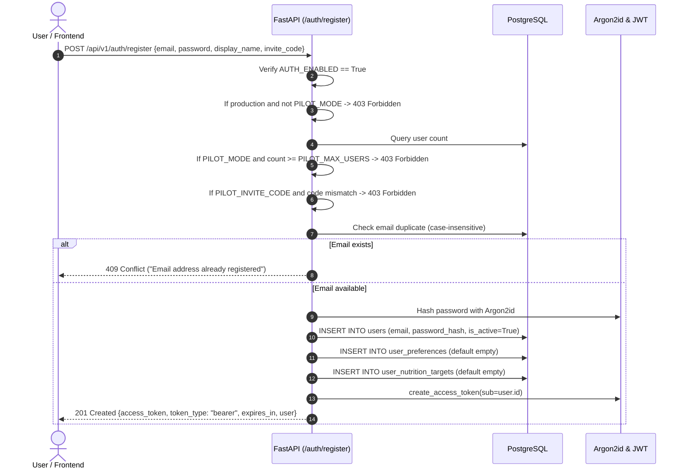
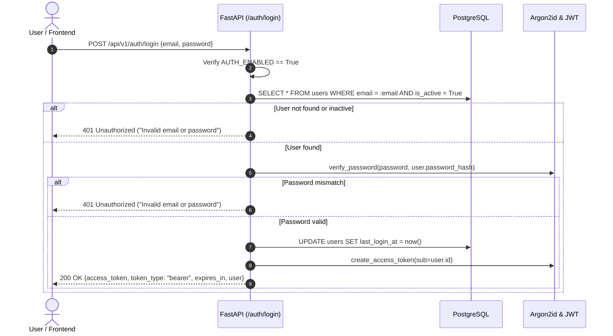
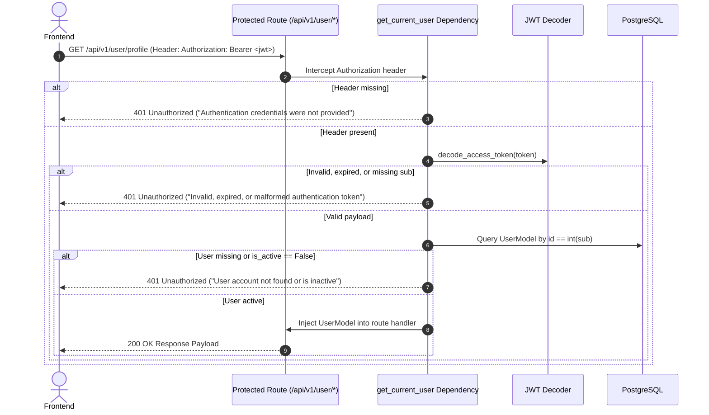
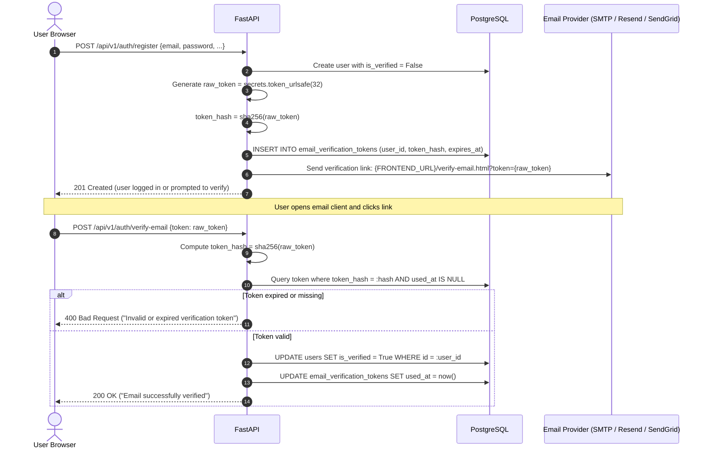
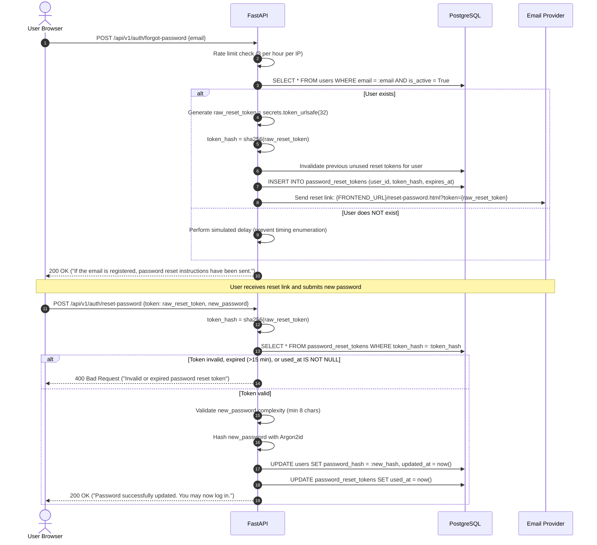
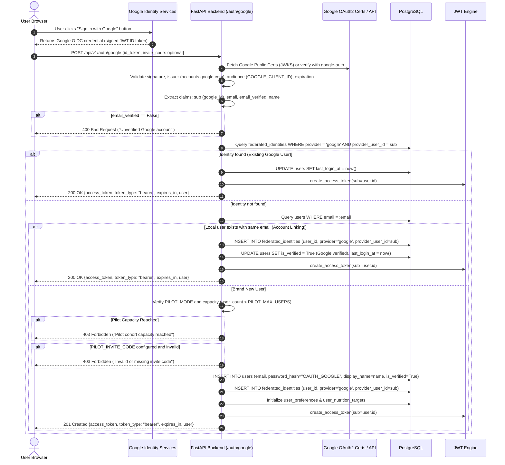

# KitchenPilot-V1 — Authentication Upgrade Plan

**Document Title:** Local-Only Authentication Architecture Audit & Upgrade Roadmap
**Target Release:** KitchenPilot-V1 Post-1.0.0 Authentication Enhancement
**Baseline Git Commit:** `a35e84a` (Release Version 1.0.0)
**Audit Date:** October 8, 2026
**Operational Status:** AUDIT COMPLETED — NO CODE MODIFIED — IMPLEMENTATION PENDING

---

## Executive Summary

KitchenPilot-V1 currently operates a secure, production-verified baseline authentication system consisting of local email/password registration, password verification using Argon2id, stateless JWT bearer tokens, role/state checks (`is_active`), pilot capacity controls (`PILOT_MODE`, `PILOT_MAX_USERS=50`), and sliding-window rate limiting.

This document details the comprehensive audit of the current authentication implementation and establishes an actionable, backwards-compatible architectural plan to add:
1. **Email Verification** (anti-abuse, verified email status, token expiration, single-use guarantees)
2. **Forgot Password & Secure Password Reset** (time-limited cryptographic tokens, SHA-256 hashed token storage, enumeration-safe endpoints)
3. **Google Identity / Sign-In via OAuth 2.0 & OpenID Connect (OIDC)** (secure token validation, account linking, CSRF/state defense, and pilot-mode capacity gating)
4. **Complete Preservation** of existing JWT schemas, user isolation, recommendation history, personalization, pantry sync, and controlled pilot policies.

> [!IMPORTANT]
> **Strict Audit Directive:** In accordance with audit requirements, **no application source code, database tables, Azure cloud infrastructure, or secrets have been modified**. This document serves solely as the technical architectural blueprint.

---

## Table of Contents
1. [Current Authentication Architecture](#1-current-authentication-architecture)
2. [Existing Authentication Flows](#2-existing-authentication-flows)
3. [Existing Security Controls](#3-existing-security-controls)
4. [Existing Database Schema](#4-existing-database-schema)
5. [Existing Frontend Authentication Behavior](#5-existing-frontend-authentication-behavior)
6. [Missing Requirements](#6-missing-requirements)
7. [Proposed Email Verification Architecture](#7-proposed-email-verification-architecture)
8. [Proposed Password Reset Architecture](#8-proposed-password-reset-architecture)
9. [Proposed Google OAuth/OIDC Architecture](#9-proposed-google-oauthoidc-architecture)
10. [Required Database Changes](#10-required-database-changes)
11. [Required API Endpoints](#11-required-api-endpoints)
12. [Required Frontend Changes](#12-required-frontend-changes)
13. [Required Environment Variables](#13-required-environment-variables)
14. [Required External Services & Providers](#14-required-external-services--providers)
15. [Security Considerations](#15-security-considerations)
16. [Token and Session Strategy](#16-token-and-session-strategy)
17. [Rate Limiting Strategy](#17-rate-limiting-strategy)
18. [Pilot-Mode Compatibility](#18-pilot-mode-compatibility)
19. [Personalization and History Compatibility](#19-personalization-and-history-compatibility)
20. [Database Migration Strategy](#20-database-migration-strategy)
21. [Testing Strategy](#21-testing-strategy)
22. [Deployment Strategy](#22-deployment-strategy)
23. [Rollback Strategy](#23-rollback-strategy)
24. [Risk Analysis & Mitigations](#24-risk-analysis--mitigations)
25. [Recommended Implementation Order](#25-recommended-implementation-order)
26. [Audit Summary & Action Checklist](#26-audit-summary--action-checklist)

---

## 1. Current Authentication Architecture

The current authentication system is implemented in the following modules:

```
src/
├── api/
│   ├── routes/
│   │   ├── auth.py              # POST /register, POST /login, GET /pilot-status
│   │   └── user.py              # GET /profile, PUT /preferences, GET /history, etc.
│   ├── dependencies.py          # get_current_user, get_optional_current_user, get_db
│   ├── middleware.py            # InMemoryRateLimiter (sliding window per IP)
│   └── config.py                # AUTH_ENABLED, AUTH_SECRET_KEY, AUTH_TOKEN_EXPIRE_MINUTES
└── personalization/
    ├── models.py                # UserModel, UserPreferenceModel, UserFeedbackModel, etc.
    ├── schemas.py               # RegisterRequest, LoginRequest, AuthResponse, UserResponse
    ├── security.py              # Argon2id PasswordHasher, create_access_token, decode_access_token
    └── service.py               # PersonalizationService (register_user, authenticate_user)
```

### Component Details
- **Password Hashing:** Implemented in `src/personalization/security.py` using `argon2.PasswordHasher` with production-grade Argon2id parameters:
  - `time_cost=2`
  - `memory_cost=65536` (64 MB)
  - `parallelism=2`
  - `hash_len=32`
  - `salt_len=16`
- **Token Format:** Signed JSON Web Tokens (PyJWT) using the `HS256` symmetric algorithm.
  - Secret key: `AUTH_SECRET_KEY` (injected via Azure secret reference in production; dev fallback in local).
  - Expiry: `AUTH_TOKEN_EXPIRE_MINUTES` (defaults to 10,080 minutes / 7 days).
  - Payload claims:
    ```json
    {
      "sub": "<user_id>",
      "iat": 1728400000,
      "exp": 1729004800
    }
    ```
- **Session Model:** Purely stateless bearer tokens transmitted in HTTP request header:
  `Authorization: Bearer <token>`
- **Authorization Enforcement:** FastAPI dependency injection:
  - `get_current_user`: Strictly enforces bearer token presence, signature verification, token expiration, subject decoding, active database record lookup, and `is_active == True`. Raises `401 Unauthorized` on any violation.
  - `get_optional_current_user`: Used by `/recommendations` to allow seamless anonymous usage while enriching responses with personalization if a valid bearer token is supplied.

---

## 2. Existing Authentication Flows

### Flow A: Local Registration (`POST /api/v1/auth/register`)


### Flow B: Local Login (`POST /api/v1/auth/login`)


### Flow C: Authenticated Request Lifecycle (`get_current_user`)


---

## 3. Existing Security Controls

| Security Control | Implementation Location | Actual Mechanism |
| :--- | :--- | :--- |
| **Password Storage** | `src/personalization/security.py` | Argon2id (`argon2-cffi`), 64MB memory, 2 iterations, 16-byte random salt. |
| **Bearer Token Validation** | `src/api/dependencies.py` | PyJWT `decode()`, verifies algorithm `HS256`, checks required claims `['sub', 'exp', 'iat']`. |
| **Timing-Attack Resistance** | `src/personalization/security.py` | `_hasher.verify()` constant-time internal comparison. |
| **Rate Limiting** | `src/api/middleware.py` | `InMemoryRateLimiter` sliding window; limits `/api/v1/auth/*` to `RATE_LIMIT_AUTH_RPM` (default 20 requests/minute per client IP). |
| **User Data Isolation** | `src/api/routes/user.py` | All queries explicitly filtered by `UserModel.id` from token `sub`. |
| **Pilot Access Gating** | `src/api/routes/auth.py` | `PILOT_MODE` kill-switch; capacity bound `PILOT_MAX_USERS`; optional `PILOT_INVITE_CODE`. |
| **CORS Policy** | `src/api/config.py` | Specific allowed origins; wildcard `*` explicitly forbidden when credentials/tokens are used. |
| **Request Correlation** | `src/api/middleware.py` | Generates or honors `X-Request-ID` across all inbound requests. |

---

## 4. Existing Database Schema

Defined in `src/personalization/models.py` and Alembic migrations `001_initial_schema`, `002_user_personalization_schema`, `9ee7090d2edc`, and `003_qualitative_feedback_schema`:

### Table: `users`
```sql
CREATE TABLE users (
    id SERIAL PRIMARY KEY,
    email VARCHAR(255) NOT NULL UNIQUE,
    password_hash VARCHAR(255) NOT NULL,
    display_name VARCHAR(128) NULL,
    is_active BOOLEAN NOT NULL DEFAULT TRUE,
    created_at TIMESTAMP WITH TIME ZONE NOT NULL DEFAULT NOW(),
    updated_at TIMESTAMP WITH TIME ZONE NOT NULL DEFAULT NOW(),
    last_login_at TIMESTAMP WITH TIME ZONE NULL
);
CREATE UNIQUE INDEX ix_users_email ON users(email);
```

### Cascading Relational Dependencies
- `user_preferences.user_id` &rarr; `users.id` (`ON DELETE CASCADE`)
- `user_nutrition_targets.user_id` &rarr; `users.id` (`ON DELETE CASCADE`)
- `user_pantry.user_id` &rarr; `users.id` (`ON DELETE CASCADE`)
- `user_feedback.user_id` &rarr; `users.id` (`ON DELETE CASCADE`)
- `recommendation_history.user_id` &rarr; `users.id` (`ON DELETE CASCADE`)
- `qualitative_feedback.user_id` &rarr; `users.id` (`ON DELETE CASCADE`)

---

## 5. Existing Frontend Authentication Behavior

- **UI Location:** Contained entirely within `frontend/recommendations.html` in the card `<section id="pilot-session-card">`.
- **Form Controls:**
  - Log In button (`#btn-show-login`) toggles email/password fields.
  - Register button (`#btn-show-register`) toggles email/password, display name, and invite code fields.
- **Client Storage:**
  - Token stored in `localStorage.getItem("kitchenpilot_token")`.
  - User profile stored in `localStorage.getItem("kitchenpilot_user")`.
- **API Wrapper:** Handled in `frontend/js/api.js`:
  - `register(email, password, displayName, inviteCode)`
  - `login(email, password)`
  - `logout()` (clears `localStorage`)
- **Missing Elements in Current Frontend:**
  - No "Forgot Password?" trigger or password reset form.
  - No email verification status badge or "Resend Verification Email" link.
  - No "Sign in with Google" button.
  - No dedicated login/registration page (currently an inline form on the recommendations page).

---

## 6. Missing Requirements

To deliver the desired final authentication experience, the following capabilities must be designed and integrated:

1. **Email Verification:**
   - Tracking verification status (`is_verified` boolean).
   - Cryptographic verification token generation, expiration, and single-use invalidation.
   - Transactional email dispatch service.
2. **Password Recovery:**
   - Password reset request endpoint generating time-bounded, single-use reset tokens.
   - Secure token hashing in the database (preventing database read leak exploitability).
   - Password reset submission endpoint validating token, enforcing minimum complexity, and re-hashing with Argon2id.
3. **Google Identity / Sign-In:**
   - OpenID Connect (OIDC) identity verification (ID token or OAuth authorization code).
   - Account linking: associating verified Google identities with existing local email accounts without overwriting preferences.
   - Safe creation of Google-authenticated accounts without requiring local passwords.
   - Pilot-mode capacity and invite code enforcement during Google onboarding.
4. **Protective Rate Limiting:**
   - Strict throttling on password reset and verification resend endpoints to prevent SMTP abuse, email bombing, and credential enumeration.

---

## 7. Proposed Email Verification Architecture

### Design Philosophy
Email verification ensures that pilot users register with legitimate, reachable mailboxes and prevents unauthorized address squatting.

### Verification Flow Architecture


### Security & Token Specifications
- **Token Generation:** `secrets.token_urlsafe(32)` (256 bits of cryptographic entropy).
- **Token Storage:** Store ONLY `hashlib.sha256(raw_token.encode()).hexdigest()`. If database backups or tables are compromised, raw verification links cannot be manufactured.
- **Expiry:** 24 hours (`EMAIL_VERIFICATION_EXPIRE_HOURS = 24`).
- **Single-Use Behavior:** Enforced via `used_at TIMESTAMP WITH TIME ZONE`. Once set, further attempts fail.
- **Resend Handling:**
  - Endpoint: `POST /api/v1/auth/resend-verification`
  - Invalidate (or delete) any previous unused verification tokens for that user.
  - Rate limited strictly: max 3 requests per hour per user/IP.

---

## 8. Proposed Password Reset Architecture

### Design Philosophy
Password reset must be completely resilient against user enumeration, timing attacks, replay attacks, and brute-force token guessing.

### Password Reset Flow Architecture


### Security Details for Password Reset
- **Anti-Enumeration:** The response message for `POST /forgot-password` must be identical whether the email exists or not.
- **Short Lifetime:** `PASSWORD_RESET_EXPIRE_MINUTES = 15` (maximum 30 minutes).
- **Single-Use Enforcement:** The token record is immediately marked `used_at = now()` in the same database transaction that updates `password_hash`.
- **Invalidation of Older Tokens:** Requesting a new reset token instantly invalidates any prior unexpired reset tokens for that user.

---

## 9. Proposed Google OAuth/OIDC Architecture

### Selected Implementation: Google Identity Services (GIS) / OIDC Verification
For modern single-page applications (SPA) communicating with decoupled REST backends on Azure Container Apps, Google's recommended standard is **Google Identity Services (OIDC ID Token exchange)** or **Authorization Code Flow with Backend Verification**.

The cleanest, most resilient architecture for KitchenPilot-V1 is **OpenID Connect (OIDC) ID Token Verification**:



### Critical Google Auth Design Principles
1. **Decoupled Identity Storage:** Create a dedicated `federated_identities` table rather than overloading `users`. This allows a user to sign in with either Google or local email/password seamlessly.
2. **Account Linking Policy:** If a user registered previously with `priya@example.com` and later signs in with Google using `priya@example.com`, the system automatically links the Google identity because Google has already cryptographically verified email ownership (`email_verified=true`).
3. **No Local Password Requirement for Pure OAuth Users:** Users registering exclusively via Google have a sentinel non-usable string in `password_hash` (e.g. `!OAUTH_GOOGLE_MANAGED`) which cannot match any Argon2id hash. If they subsequently want to use email/password login, they can use the "Forgot Password" flow to set a local password.
4. **Pilot Capacity Gating for OAuth:** A user signing in via Google for the first time is considered a registration event. The system **must** check `PILOT_MODE`, `user_count < PILOT_MAX_USERS`, and verify `PILOT_INVITE_CODE` before provisioning the user.

---

## 10. Required Database Changes

To support email verification, password reset, and Google federation without altering existing tables destructively, the schema requires:
- Minor non-breaking column additions to `users`.
- Three new specialized tables.

### 1. Schema Additions to `users`
```sql
ALTER TABLE users ADD COLUMN is_verified BOOLEAN NOT NULL DEFAULT FALSE;
ALTER TABLE users ADD COLUMN auth_provider VARCHAR(32) NOT NULL DEFAULT 'local';
```
*(Existing users are migrated to `is_verified = TRUE` so current active pilot participants are not locked out).*

### 2. New Table: `email_verification_tokens`
```sql
CREATE TABLE email_verification_tokens (
    id SERIAL PRIMARY KEY,
    user_id INTEGER NOT NULL REFERENCES users(id) ON DELETE CASCADE,
    token_hash VARCHAR(64) NOT NULL UNIQUE,
    expires_at TIMESTAMP WITH TIME ZONE NOT NULL,
    created_at TIMESTAMP WITH TIME ZONE NOT NULL DEFAULT NOW(),
    used_at TIMESTAMP WITH TIME ZONE NULL
);
CREATE INDEX ix_email_verification_token_hash ON email_verification_tokens(token_hash);
CREATE INDEX ix_email_verification_user_id ON email_verification_tokens(user_id);
```

### 3. New Table: `password_reset_tokens`
```sql
CREATE TABLE password_reset_tokens (
    id SERIAL PRIMARY KEY,
    user_id INTEGER NOT NULL REFERENCES users(id) ON DELETE CASCADE,
    token_hash VARCHAR(64) NOT NULL UNIQUE,
    expires_at TIMESTAMP WITH TIME ZONE NOT NULL,
    created_at TIMESTAMP WITH TIME ZONE NOT NULL DEFAULT NOW(),
    used_at TIMESTAMP WITH TIME ZONE NULL
);
CREATE INDEX ix_password_reset_token_hash ON password_reset_tokens(token_hash);
CREATE INDEX ix_password_reset_user_id ON password_reset_tokens(user_id);
```

### 4. New Table: `federated_identities`
```sql
CREATE TABLE federated_identities (
    id SERIAL PRIMARY KEY,
    user_id INTEGER NOT NULL REFERENCES users(id) ON DELETE CASCADE,
    provider VARCHAR(32) NOT NULL,              -- e.g. 'google'
    provider_user_id VARCHAR(255) NOT NULL,      -- Google 'sub' claim
    email VARCHAR(255) NOT NULL,
    created_at TIMESTAMP WITH TIME ZONE NOT NULL DEFAULT NOW(),
    updated_at TIMESTAMP WITH TIME ZONE NOT NULL DEFAULT NOW(),
    CONSTRAINT uq_federated_provider_user UNIQUE(provider, provider_user_id),
    CONSTRAINT uq_federated_user_provider UNIQUE(user_id, provider)
);
CREATE INDEX ix_federated_identities_user ON federated_identities(user_id);
```

---

## 11. Required API Endpoints

### Summary of New and Modified API Routes
| Route | Method | Access | Rate Limit | Purpose |
| :--- | :---: | :---: | :---: | :--- |
| **`/api/v1/auth/register`** | `POST` | Public | 5 / min | *Modified:* Creates user with `is_verified=False` (or True in dev/test); triggers verification token. |
| **`/api/v1/auth/verify-email`** | `POST` | Public | 10 / min | *New:* Validates token, marks email verified. |
| **`/api/v1/auth/resend-verification`** | `POST` | Public | 3 / hour | *New:* Dispatches fresh verification email to unverified user. |
| **`/api/v1/auth/forgot-password`** | `POST` | Public | 3 / hour | *New:* Generates hashed reset token and dispatches reset instructions. |
| **`/api/v1/auth/reset-password`** | `POST` | Public | 5 / min | *New:* Validates reset token and updates password hash. |
| **`/api/v1/auth/google`** | `POST` | Public | 10 / min | *New:* Verifies Google ID token, links account or creates pilot user, returns JWT. |
| **`/api/v1/user/profile`** | `GET` | Authenticated | 30 / min | *Modified:* Returns `is_verified` and linked `auth_provider` status in payload. |

---

## 12. Required Frontend Changes

1. **Centralized Auth Modal / Separate Auth Views:**
   - Add a tabbed or multi-state modal supporting:
     - Log In (Email/Password)
     - Register (Email/Password + Display Name + Invite Code)
     - Forgot Password (Email submission)
     - Reset Password View (Token from URL query string)
     - Verify Email View (Token from URL query string)
2. **Google Sign-In Button Integration:**
   - Include Google Identity Services library (`https://accounts.google.com/gsi/client`).
   - Render standard Google button (`google.accounts.id.renderButton`).
   - Callback routes the returned ID token to `window.KitchenPilotApi.googleLogin(idToken, inviteCode)`.
3. **Session State Indicators:**
   - Display a warning badge if `is_verified == False`: "Please verify your email address to ensure account recovery."
4. **API Client (`frontend/js/api.js`):**
   - Add helper functions:
     - `verifyEmail(token)`
     - `resendVerification(email)`
     - `forgotPassword(email)`
     - `resetPassword(token, newPassword)`
     - `loginWithGoogle(idToken, inviteCode)`

---

## 13. Required Environment Variables

To be defined in `.env.example` and injected via Azure Secret References in production:

```ini
# ============================================================================
# Email Delivery Service Configuration (SMTP / API)
# ============================================================================
EMAIL_ENABLED=false                         # Set to true when mail provider is active
EMAIL_BACKEND=smtp                          # 'smtp', 'sendgrid', 'resend', or 'console' (for dev)
SMTP_HOST=smtp.sendgrid.net
SMTP_PORT=587
SMTP_USER=apikey
SMTP_PASSWORD=REPLACE_WITH_SMTP_API_KEY
SMTP_USE_TLS=true
EMAIL_FROM_ADDRESS=noreply@kitchenpilot.app
EMAIL_FROM_NAME="KitchenPilot Team"
FRONTEND_URL=http://localhost:5500          # Base URL for verification/reset links

# ============================================================================
# Google OAuth / OpenID Connect (OIDC) Configuration
# ============================================================================
GOOGLE_AUTH_ENABLED=false                   # Set to true when credentials are provisioned
GOOGLE_CLIENT_ID=REPLACE_WITH_GOOGLE_CLIENT_ID.apps.googleusercontent.com
# Google Client Secret is needed only if using Server-Side Authorization Code Flow
GOOGLE_CLIENT_SECRET=REPLACE_WITH_GOOGLE_CLIENT_SECRET

# ============================================================================
# Verification & Reset Expirations
# ============================================================================
EMAIL_VERIFICATION_EXPIRE_HOURS=24
PASSWORD_RESET_EXPIRE_MINUTES=15
REQUIRE_EMAIL_VERIFICATION_FOR_LOGIN=false  # Soft launch: false; strict enforcement: true
```

---

## 14. Required External Services & Providers

1. **Transactional Email Service Provider:**
   - *Options:* SendGrid, Resend, Amazon SES, or Azure Communication Services (Email).
   - *Requirement:* Dedicated domain verification (SPF, DKIM, DMARC) so verification and reset emails reach users' inboxes rather than spam folders.
   - *Development Fallback:* Local `console` backend that prints reset/verification links directly to terminal logs without requiring internet connectivity.
2. **Google Cloud Console Project:**
   - *Resource:* Google Cloud Project with OAuth 2.0 Consent Screen configured.
   - *Scopes Required:* `openid`, `email`, `profile`.
   - *Authorized JavaScript Origins:*
     - Development: `http://localhost:5500`, `http://127.0.0.1:5500`
     - Production: `https://kitchenpilot-api.whitestone-ffca5e6e.malaysiawest.azurecontainerapps.io`, production domain.
   - *Authorized Redirect URIs:* (If using backend authorization code redirect).

---

## 15. Security Considerations

1. **Token Storage Protection:**
   - **Rule:** Never store plaintext reset or verification tokens in the database.
   - **Implementation:** Always store `SHA-256(raw_token)`. If a database snapshot is leaked, attackers cannot generate valid reset links.
2. **Anti-Enumeration Protection:**
   - `POST /api/v1/auth/forgot-password` must execute in constant-time (or near constant-time) and always return HTTP 200 with identical messages regardless of whether the email is present.
3. **Password Hashing Consistency:**
   - All password resets must use the existing production Argon2id configuration (`time_cost=2`, `memory_cost=65536`, `parallelism=2`).
4. **Google Token Cryptographic Verification:**
   - Never trust client-provided claims in the request body. The ID token must be verified against Google's public keys (`https://www.googleapis.com/oauth2/v3/certs`) or via Google's official client library (`google-auth`).
   - Validate that `aud` strictly equals `GOOGLE_CLIENT_ID`.
   - Validate that `iss` is `accounts.google.com` or `https://accounts.google.com`.
   - Validate `exp` timestamp.
5. **No Exposure of Secrets:**
   - `GOOGLE_CLIENT_SECRET`, `SMTP_PASSWORD`, and `AUTH_SECRET_KEY` must never be checked into Git, printed in logs, or exposed to the frontend.

---

## 16. Token and Session Strategy

- **Stateless Bearer Tokens Retained:** The existing JWT schema (`sub: str(user.id)`, `iat`, `exp`) remains completely intact.
- **Why?** All existing user personalization features, recommendation history queries, feedback submissions, and pantry syncing depend on `user.id`.
- **Seamless Upgrade:** Both local and Google-authenticated users receive the exact same JWT format upon authentication. This means downstream recommendation engines, ranking filters, and database models require **zero modifications**.

---

## 17. Rate Limiting Strategy

Enhance `src/api/middleware.py` sliding-window limiter with dedicated route limits:

| Route Key | Rate Limit | Window | Purpose |
| :--- | :---: | :---: | :--- |
| `/api/v1/auth/forgot-password` | 3 requests | 60 minutes | Prevents email spamming and inbox flooding. |
| `/api/v1/auth/resend-verification` | 3 requests | 60 minutes | Prevents email delivery quota exhaustion. |
| `/api/v1/auth/reset-password` | 5 requests | 15 minutes | Prevents brute-forcing short reset tokens. |
| `/api/v1/auth/login` | 10 requests | 1 minute | Prevents credential-stuffing attacks. |
| `/api/v1/auth/register` | 5 requests | 1 minute | Prevents account spamming. |
| `/api/v1/auth/google` | 10 requests | 1 minute | Protects OIDC exchange endpoint. |

---

## 18. Pilot-Mode Compatibility

The upgraded authentication architecture strictly preserves all pilot controls:
1. **Pilot Mode Toggle (`PILOT_MODE`):**
   - If `ENVIRONMENT == "production"` and `PILOT_MODE == False`, Google registration and local registration remain completely blocked.
2. **Cohort Capacity Limit (`PILOT_MAX_USERS`):**
   - When a new Google user attempts sign-in, the system counts existing users (`db.query(func.count(UserModel.id))`). If `count >= PILOT_MAX_USERS`, the endpoint rejects registration with `403 Forbidden ("Pilot cohort capacity reached")`.
   - Existing enrolled users (both local and Google) can continue to log in without restriction.
3. **Invite Code Enforcement (`PILOT_INVITE_CODE`):**
   - If an invite code is active, the Google sign-in modal must prompt new users for their invite code prior to account provisioning.

---

## 19. Personalization and History Compatibility

- **User ID Invariant:** All personalization logic uses integer primary key `UserModel.id`.
- **Zero Schema Breakage:** Because `UserModel.id` is preserved as the single foreign key for `user_preferences`, `user_nutrition_targets`, `user_pantry`, `user_feedback`, and `recommendation_history`, linking a Google identity to an existing local user causes **zero data disruption**.
- Past likes, dislikes, cooked logs, and recommendation histories are immediately accessible when logging in via Google.

---

## 20. Database Migration Strategy

The migration must be linear and additive:

```
[001_initial_schema]
         │
         ▼
[002_user_personalization_schema]
         │
         ▼
[9ee7090d2edc_add_session_id_to_user_feedback]
         │
         ▼
[003_qualitative_feedback_schema]  <-- Current Production Head
         │
         ▼
[004_authentication_upgrade_schema]  <-- Next Migration
```

### Migration Specification (`alembic/versions/004_authentication_upgrade_schema.py`)
- **`upgrade()` Operations:**
  1. Add `is_verified` (boolean, default False) and `auth_provider` (varchar(32), default 'local') to `users`.
  2. Execute `UPDATE users SET is_verified = TRUE;` (ensures existing test/production accounts remain verified).
  3. Create table `email_verification_tokens` with index on `token_hash`.
  4. Create table `password_reset_tokens` with index on `token_hash`.
  5. Create table `federated_identities` with unique constraints on `(provider, provider_user_id)` and `(user_id, provider)`.
- **`downgrade()` Operations:**
  1. Drop tables `federated_identities`, `password_reset_tokens`, `email_verification_tokens`.
  2. Drop columns `auth_provider`, `is_verified` from `users`.

---

## 21. Testing Strategy

A dedicated test suite `tests/test_auth_upgrade.py` must verify all new paths:

1. **Email Verification Tests:**
   - Registration creates unverified user and generates hashed token.
   - Valid token verifies user and sets `is_verified = True`.
   - Expired token is rejected with 400.
   - Reused token is rejected with 400.
   - Resend verification rate-limiting check.
2. **Password Reset Tests:**
   - `forgot-password` returns 200 for existing and non-existing email (anti-enumeration check).
   - Valid token resets password and updates Argon2id hash.
   - Old password no longer works; new password successfully authenticates.
   - Expired or already-used reset token fails.
3. **Google Auth Tests (Mocked OIDC):**
   - Mocked valid Google ID token logs in existing linked user.
   - Mocked valid Google ID token links local account with matching email.
   - Mocked valid Google ID token provisions new pilot user when capacity allows.
   - Capacity overflow (>50 users) correctly blocks new Google registration with 403.
   - Invalid token signature or mismatched client ID returns 401.
4. **Regression Invariant Tests:**
   - Existing anonymous recommendation parity verified.
   - Existing authenticated recommendation history logging verified.
   - Rate limiter blocks requests exceeding threshold.

---

## 22. Deployment Strategy

1. **Phase 1: Local Sandbox Testing:**
   - Run Alembic migration against local SQLite/PostgreSQL test database.
   - Verify all 248 existing tests + new auth tests pass (`pytest`).
2. **Phase 2: Staging / Verification:**
   - Deploy image with new endpoints, but with `EMAIL_ENABLED=false` and `GOOGLE_AUTH_ENABLED=false` to verify zero regression on existing login.
3. **Phase 3: Azure Secrets Provisioning:**
   - Add `GOOGLE_CLIENT_ID`, `SMTP_HOST`, `SMTP_PASSWORD` to Azure Key Vault / Container App Secret References.
4. **Phase 4: Run Production Migration:**
   - Execute `alembic upgrade head` in Azure Container App.
5. **Phase 5: Feature Flag Activation:**
   - Set `EMAIL_ENABLED=true` and `GOOGLE_AUTH_ENABLED=true`.

---

## 23. Rollback Strategy

If any failure occurs during or after deployment:
1. **Immediate Feature Flag Disable:**
   - Set `GOOGLE_AUTH_ENABLED=false` and `EMAIL_ENABLED=false` in Container App environment variables.
   - The application instantly reverts to pure local email/password authentication without requiring database changes or code rollback.
2. **Database Rollback:**
   - If migration rollback is required: `alembic downgrade -1`.
   - Because all changes are additive (new tables and non-null-with-default columns), rolling back the code without rolling back the schema does **not** break running services.

---

## 24. Risk Analysis & Mitigations

| Risk | Severity | Probability | Mitigation Strategy |
| :--- | :---: | :---: | :--- |
| **Email Deliverability Failure (SMTP down / spam flag)** | High | Medium | Implement fallback: allow user login even if unverified (`REQUIRE_EMAIL_VERIFICATION_FOR_LOGIN=false` during pilot). |
| **Google OIDC Token Validation Latency** | Medium | Low | Cache Google public keys (JWKS) locally for 24 hours using standard cache-control headers rather than querying Google per request. |
| **Pilot Cohort Bypassed via Google** | High | Low | Explicitly invoke `PILOT_MODE` and capacity check inside Google auth handler before provisioning `UserModel`. |
| **Database Token Leak** | Critical | Low | Store only `SHA-256` token digests in `email_verification_tokens` and `password_reset_tokens`. |
| **Account Takeover via Unverified Email** | High | Low | Only link accounts automatically if Google returns `email_verified == True`. |

---

## 25. Recommended Implementation Order

To ensure uninterrupted service and step-by-step verification, follow this 6-stage implementation sequence:

```
Stage 1: Core Security & Models (Backend Data Layer)
  ├── 1.1 Add email & token utilities in src/personalization/security.py
  ├── 1.2 Define new ORM models in src/personalization/models.py
  └── 1.3 Create and test Alembic migration 004_authentication_upgrade_schema.py

Stage 2: Email Verification & Password Reset Service Layer
  ├── 2.1 Implement email dispatcher abstraction (Console / SMTP) in src/services/email.py
  ├── 2.2 Add verification & reset methods to PersonalizationService
  └── 2.3 Add endpoints in src/api/routes/auth.py (/forgot-password, /reset-password, /verify-email)

Stage 3: Google OAuth / OIDC Service Layer
  ├── 3.1 Install and configure google-auth library in requirements.txt
  ├── 3.2 Implement Google token verification helper in src/personalization/security.py
  └── 3.3 Add POST /api/v1/auth/google endpoint in src/api/routes/auth.py

Stage 4: Middleware Rate Limiting Upgrades
  └── 4.1 Configure strict route-specific sliding-window limits in src/api/middleware.py

Stage 5: Frontend UI Upgrades
  ├── 5.1 Add Google Sign-In SDK and button rendering in frontend/recommendations.html
  ├── 5.2 Add Forgot Password and Reset Password modals/views
  └── 5.3 Implement API client helpers in frontend/js/api.js

Stage 6: Comprehensive Regression Testing & Staged Deployment
  ├── 6.1 Execute complete automated test suite (existing + new)
  ├── 6.2 Validate migration on local PostgreSQL
  └── 6.3 Deploy to Azure Container Apps with feature flags
```

---

## 26. Audit Summary & Action Checklist

### Exact Files That Would Need Modification
1. `requirements.txt`: Add `google-auth>=2.28.0,<3.0` (for OIDC validation) and `aiosmtplib>=3.0.0` (for async email dispatch).
2. `src/api/config.py`: Add environment variables for email, Google client ID, and token expiration settings.
3. `src/personalization/models.py`: Add `is_verified`, `auth_provider` to `UserModel`; add `EmailVerificationTokenModel`, `PasswordResetTokenModel`, `FederatedIdentityModel`.
4. `src/personalization/schemas.py`: Add schemas for forgot-password, reset-password, verify-email, and Google login requests/responses.
5. `src/personalization/security.py`: Add SHA-256 token hashing helpers and Google ID token validation function.
6. `src/personalization/service.py`: Add business logic for email verification, reset workflows, and Google identity linking.
7. `src/api/routes/auth.py`: Add `/verify-email`, `/resend-verification`, `/forgot-password`, `/reset-password`, `/google`.
8. `src/api/middleware.py`: Add rate limiting rules for reset and verification routes.
9. `frontend/js/api.js`: Add API wrappers for new endpoints.
10. `frontend/recommendations.html`: Add Google Sign-In button container and modal triggers for password recovery.
11. `frontend/js/recommendations.js`: Handle Google callback, forgot-password submission, and reset token parameters.
12. `.env.example`: Document new optional configuration variables.

### Exact Database Migration Required
- Single linear Alembic migration:
  `alembic/versions/004_authentication_upgrade_schema.py`
  (revising `003_qualitative_feedback_schema`).

### Exact New API Routes
- `POST /api/v1/auth/verify-email`
- `POST /api/v1/auth/resend-verification`
- `POST /api/v1/auth/forgot-password`
- `POST /api/v1/auth/reset-password`
- `POST /api/v1/auth/google`

### Security Risks Discovered in Current Implementation
- **No Token Hashing Defect:** Currently, the application had no reset or verification tables, so no token hashing defect exists. However, when implemented, raw tokens **must never be stored directly in the database**.
- **Password Hasher Confirmation:** The code in `src/personalization/security.py` uses **Argon2id** (`argon2-cffi`), which is currently the state-of-the-art password hashing standard (superior to PBKDF2). It should be retained without modification.
- **Unverified Accounts:** Existing users currently do not verify email ownership. The upgrade plan safely defaults existing users to `is_verified=True` and applies verification to new sign-ups.

---

*End of Authentication Upgrade Plan.*
