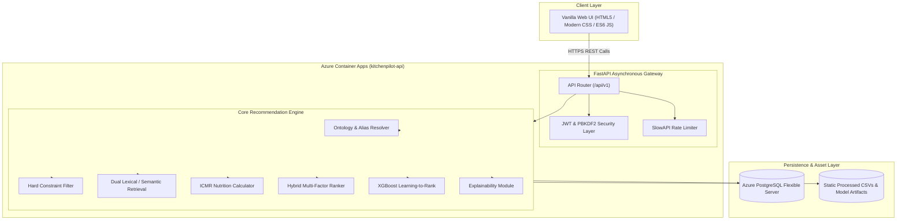
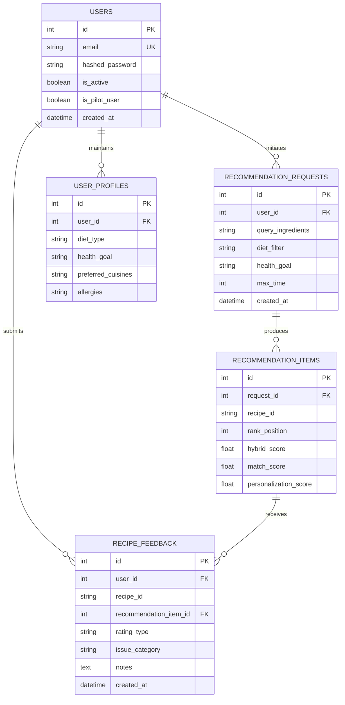

# KitchenPilot-V1: Deterministic, Explainable Personalized Indian Recipe Recommendation Engine

**Project Track:** Customized AI Kitchen for India (Intel Unnati-3)
**Academic Program:** B.Tech in Computer Science and Engineering (Data Science)
**System Baseline:** KitchenPilot-V1 (Release Version 1.0.0, Git Commit `a35e84a`)
**Deployment State:** Verified Production Deployment (Azure Container Apps)
**Operational Status:** Software & Infrastructure Ready — Longitudinal Pilot Data Collection Pending

---

## Table of Contents
1. [Title](#1-title)
2. [Abstract](#2-abstract)
3. [Introduction](#3-introduction)
4. [Problem Statement](#4-problem-statement)
5. [Motivation](#5-motivation)
6. [Objectives](#6-objectives)
7. [Scope](#7-scope)
8. [Existing System](#8-existing-system)
9. [Limitations of Existing System](#9-limitations-of-existing-system)
10. [Proposed System](#10-proposed-system)
11. [Key Features](#11-key-features)
12. [System Architecture](#12-system-architecture)
13. [System Workflow](#13-system-workflow)
14. [Dataset](#14-dataset)
15. [Data Preprocessing](#15-data-preprocessing)
16. [Ingredient Ontology](#16-ingredient-ontology)
17. [Recommendation Methodology](#17-recommendation-methodology)
18. [Ingredient Matching](#18-ingredient-matching)
19. [Similarity / TF-IDF](#19-similarity--tf-idf)
20. [Nutrition Scoring](#20-nutrition-scoring)
21. [Hybrid Ranking](#21-hybrid-ranking)
22. [XGBoost Ranking Model](#22-xgboost-ranking-model)
23. [Personalization](#23-personalization)
24. [Constraint Engine](#24-constraint-engine)
25. [Explainability](#25-explainability)
26. [Feedback System](#26-feedback-system)
27. [Database Design](#27-database-design)
28. [API Design](#28-api-design)
29. [Frontend](#29-frontend)
30. [Authentication and Security](#30-authentication-and-security)
31. [Deployment Architecture](#31-deployment-architecture)
32. [Testing](#32-testing)
33. [Production Validation](#33-production-validation)
34. [Results / Current Observations](#34-results--current-observations)
35. [Pilot Status](#35-pilot-status)
36. [Limitations](#36-limitations)
37. [Future Scope](#37-future-scope)
38. [Conclusion](#38-conclusion)
39. [References](#39-references)

---

## 1. Title

**KitchenPilot-V1: Deterministic, Explainable Personalized Indian Recipe Recommendation Engine**
A production-engineered Machine Learning and Information Retrieval system customized for Indian domestic kitchens, inventory utilization, strict dietary adherence, and multi-factor ranking.

---

## 2. Abstract

Household food waste and daily culinary decision fatigue are prevalent challenges across urban Indian households. Conventional recipe recommendation systems typically prioritize general popularity or Western-centric culinary structures, failing to accommodate regional Indian dietary practices, multi-lingual ingredient nomenclature, domestic pantry inventories, and strict religious or physiological constraints.

This project presents **KitchenPilot-V1**, an end-to-end, deterministic, and explainable recipe recommendation platform engineered specifically for the Indian domestic context under the Intel Unnati-3 initiative. KitchenPilot-V1 combines lexical information retrieval (sublinear TF-IDF with sub-ingredient matching), dense semantic search (`bge-small-en-v1.5`), a standardized Indian ingredient ontology (129 canonical entities and 284 alias mappings across Hindi and regional dialects), and an ICMR-aligned nutritional scoring engine. The retrieval architecture filters candidates through a strict zero-tolerance hard constraint engine enforcing diet types (Vegetarian, Vegan, Jain, Eggetarian, Non-Vegetarian) and critical allergen eliminations. Candidate recipes are scored using a weighted multi-factor hybrid ranker balancing ingredient availability, lexical matching, semantic intent, nutritional balance, and user feedback history, with a weak-supervision pairwise learning-to-rank XGBoost model serving as an advanced ranking stage.

The platform is engineered using modern cloud-native principles, featuring a Python FastAPI asynchronous backend, a PostgreSQL relational schema managed via Alembic migrations, a lightweight responsive Vanilla HTML5/CSS/JavaScript frontend, and containerized deployment on Azure Container Apps. The software implementation is fully validated across 248 passing unit and integration tests, strict production data validation gates, and live production deployment smoke tests. In accordance with rigorous data science principles, the software and cloud infrastructure are verified and production-ready, while the frozen weak-supervision ranking model awaits longitudinal real-world pilot user data collection for subsequent empirical evaluation and retraining.

---

## 3. Introduction

The daily decision of what to cook in an Indian household is influenced by a dynamic interplay of factors: currently available perishables in the pantry, strict cultural and religious dietary restrictions (such as Jain, Sattvic, or pure vegetarian diets), family health goals, and culinary diversity. Despite the proliferation of digital recipe repositories, domestic cooking frequently results in household food waste due to unutilized perishables, unbalanced meal compositions, and repetitive meal planning.

Recommending recipes in the Indian context introduces specialized challenges that Western-oriented recommendation platforms fail to solve:
1. **Linguistic and Regional Diversity:** Ingredients are known by multiple colloquial, Hindi, and regional names (e.g., *Methi* vs. *Fenugreek*, *Dhania* vs. *Coriander*, *Haldi* vs. *Turmeric*).
2. **Strict Constraint Inflexibility:** In Indian dietary ethics, non-negotiable constraints exist—such as Jain diets disallowing root vegetables (onions, potatoes, garlic), or strict vegetarian households rejecting eggs or animal broths. A recommendation that violates a hard dietary boundary cannot be compensated for by high ingredient similarity.
3. **Pantry-Driven Utilization:** Recommendations must maximize the utilization of perishable household stock while cleanly classifying missing ingredients into core staples vs. optional garnishes.
4. **Explainability and Trust:** Users require clear, transparent reasoning behind recommendations (e.g., "Matched 4 of 5 ingredients; requires 1 staple; conforms to your Jain diet").

KitchenPilot-V1 was conceptualized and developed to address these structural challenges through a robust, hybrid machine learning and constraint-driven recommendation architecture.

---

## 4. Problem Statement

To design, develop, test, and deploy a robust, deterministic, and explainable recipe recommendation engine tailored for Indian households that:
1. Accepts available pantry ingredients in English, Hindi, and regional aliases and accurately maps them to canonical culinary entities.
2. Applies strict hard constraints for religious, ethical, and physiological requirements (Vegetarian, Vegan, Jain, Eggetarian, Non-Vegetarian, Allergen-free), guaranteeing zero violations.
3. Retrieves relevant candidates from an Indian recipe repository using a dual lexical (TF-IDF) and dense semantic retrieval pipeline.
4. Evaluates nutritional compositions against standardized Indian Council of Medical Research (ICMR) dietary guidelines.
5. Scores and ranks candidates using a hybrid multi-objective scoring formulation incorporating user personalization and feedback.
6. Delivers recommendations through a secure, cloud-deployed RESTful API and an accessible web application interface.

---

## 5. Motivation

1. **Food Waste Mitigation:** A substantial portion of domestic vegetable and perishable food waste results from households failing to utilize partially remaining ingredients before spoilage. Providing accurate "cook-with-what-you-have" recommendations directly addresses this waste.
2. **Context-Aware Indian Culinary AI:** Most international recipe engines categorize Indian food monolithically. An ontology-grounded system recognizes regional cooking foundations (e.g., tadka, tempering spices) and treats pantry staples distinctly from primary hero vegetables.
3. **Transparent Decision Support:** Rather than treating recommendations as opaque black-box outputs, domestic cooks need actionable clarity: what can be cooked immediately, what single ingredient needs to be purchased, and why a specific meal was suggested.
4. **Engineering Rigor in Data Science:** Transitioning recommendation algorithms from theoretical Jupyter notebooks to reliable, containerized, audited, and secure cloud microservices adhering to production software engineering standards.

---

## 6. Objectives

### Primary Objectives
- **Ontology Standardization:** Build and validate an Indian culinary ontology mapping multi-lingual aliases and pantry items to canonical ingredients.
- **Strict Constraint Enforcement:** Implement a deterministic hard constraint engine guaranteeing zero-tolerance filtering for allergens and dietary classifications (including Jain and root-vegetable restrictions).
- **Hybrid Retrieval & Ranking:** Combine sublinear TF-IDF vector space retrieval, dense semantic retrieval (`bge-small-en-v1.5`), and ICMR-aligned nutritional scoring into a composite scoring model.
- **Pairwise Learning-to-Rank Exploration:** Integrate an XGBoost ranking prototype utilizing 30 hand-crafted features with a graceful fallback to deterministic hybrid scoring.
- **Explainability:** Generate natural-language explanations decomposing ingredient matches, missing items, nutritional suitability, and constraint satisfaction for every recommendation.
- **Production Cloud Architecture:** Deploy the system to Microsoft Azure Container Apps with managed PostgreSQL, automated Alembic migrations, JWT authentication, and comprehensive test coverage.

### Operational Guardrails
- Maintain a strict boundary between automated software verification and real-world empirical pilot evaluation.
- Prevent fabrication of synthetic user interaction data or unverified statistical claims.

---

## 7. Scope

### In Scope
- **Dataset:** 6,871 curated Indian recipes with precomputed nutritional metrics, ingredient linkages, and pre-tokenized corpus representations.
- **Ontology:** 129 canonical Indian culinary ingredients and 284 active alias mappings.
- **Dietary Regimes:** Vegetarian, Vegan, Jain, Eggetarian, and Non-Vegetarian.
- **Allergen Filtration:** Dairy, Peanuts, Tree Nuts, Gluten, Soy, Egg, Shellfish, Fish.
- **Retrieval Mechanisms:** Sublinear TF-IDF (17,045 vocabulary dimensions) and dense semantic retrieval (384-dimensional dense vectors).
- **Personalization:** Session-based user feedback capture (Likes, Dislikes, Cook-counts) adjusting user preference profiles.
- **Software Stack:** FastAPI, SQLAlchemy 2.0, PostgreSQL, Docker, Azure Container Apps, Vanilla HTML5/CSS/JavaScript.

### Explicitly Out of Scope (Current Release)
- **Computer Vision / Image Recognition:** The current release does not process refrigerator or pantry photos; ingredient input is structured text/token-based.
- **Third-Party Identity Providers:** Third-party OAuth (e.g., Google/Apple sign-in) and automated email verification workflows are not implemented; authentication relies on local salted hashing and JWT tokens.
- **Longitudinal Pilot Metrics:** Empirical real-world ranking metrics (e.g., post-pilot NDCG@K, conversion rates) cannot be reported prior to field data collection.

---

## 8. Existing System

Traditional culinary platforms and general-purpose recommendation tools generally operate under one of three paradigms:
1. **Keyword-Based Search Portals:** Recipe blogs and portals (e.g., Tarla Dalal, Sanjeev Kapoor, AllRecipes) utilize standard relational SQL or Elasticsearch queries matching recipe titles or ingredient tags.
2. **Collaborative Filtering Platforms:** Large-scale commercial platforms rely on user-item matrix factorization (e.g., ALS, SVD) or neural collaborative filtering derived from millions of public ratings.
3. **Generative LLM Chatbots:** Modern users increasingly prompt large language models (e.g., ChatGPT) with available ingredients to generate recipe ideas ad-hoc.

---

## 9. Limitations of Existing System

1. **Inability to Handle Pantry Subsets:** Keyword engines require exact matches; if a user specifies 5 items, search either returns nothing (strict AND) or thousands of recipes containing only 1 item (loose OR).
2. **Cold-Start Vulnerability:** Collaborative filtering completely fails for newly listed recipes, regional domestic variants, or users without extensive historical interaction data.
3. **Safety and Dietary Hallucinations:** Generative LLMs frequently hallucinate recipe steps or inadvertently introduce forbidden ingredients (e.g., suggesting garlic or onion in a recipe claimed to be Jain, or using dairy butter in a vegan dish).
4. **Lack of Nutritional Grounding:** Existing search engines rarely score meals against verified dietary allowances (such as ICMR standards) relative to available pantry contents.
5. **Absence of Regional Alias Normalization:** Searching for *Aloo* will fail to return recipes indexed under *Potato* or *Batata* unless manual cross-indexing exists.

---

## 10. Proposed System

KitchenPilot-V1 introduces a multi-tier, deterministic-first recommendation pipeline designed specifically for domestic Indian culinary environments:

```
[User Pantry Input + Dietary Constraints + Goals]
                         │
                         ▼
        [Ingredient Ontology & Alias Resolver]
                         │
                         ▼
             [Hard Constraint Engine] ──(Disqualifies violators)──► [Rejected]
                         │
           (Passed Candidate Pool)
                         │
        ┌────────────────┴────────────────┐
        ▼                                 ▼
[Lexical Sublinear TF-IDF]     [Dense Semantic Retrieval]
(Vocabulary: 17,045 dims)      (bge-small-en-v1.5: 384 dims)
        └────────────────┬────────────────┘
                         │
                         ▼
              [Ingredient Matcher]
    (Direct Match, Alias Match, Sub-Ingredient Match)
                         │
                         ▼
            [ICMR Nutrition Calculator]
                         │
                         ▼
          [Hybrid Multi-Factor Ranker]
                         │
                         ▼
      [XGBoost Pairwise Ranker (with Fallback)]
                         │
                         ▼
     [Personalization & Feedback Profile Blending]
                         │
                         ▼
      [Explainability & Transparency Engine]
                         │
                         ▼
[Top-N Ranked Recommendations + Matched/Missing Breakdown + Rationale]
```

The system combines deterministic dietary safety, semantic and lexical retrieval breadth, standardized nutritional scoring, and machine-learned ranking into a single cohesive, highly observable pipeline.

---

## 11. Key Features

1. **Multi-Dialect Alias Resolution:** Automatically normalizes English, Hindi, and colloquial terms into standardized canonical entities.
2. **Zero-Tolerance Hard Constraint Filtering:** Deterministic exclusion of allergens and religious dietary conflicts prior to scoring.
3. **Sub-Ingredient & Partial Matching:** Distinguishes primary recipe items from minor compound mentions (e.g., *ginger-garlic paste* matches both *ginger* and *garlic*).
4. **ICMR-Aligned Nutritional Evaluation:** Evaluates calorie, protein, carbohydrate, and fat proportions against Indian nutritional benchmarks.
5. **Explainable Output Payloads:** Provides itemized matching statistics, missing ingredient lists, and transparent textual rationales for each recommendation.
6. **Closed-Loop Feedback System:** Captures explicit user interactions (Likes, Dislikes, Cook-now logs, qualitative issue tags) to dynamically update user preference vectors.
7. **Controlled Pilot Infrastructure:** Built-in pilot mode toggle (`PILOT_MODE`), capacity gating (`PILOT_MAX_USERS=50`), and automated database migrations.

---

## 12. System Architecture

KitchenPilot-V1 is engineered as a decoupled, multi-layer cloud application:



### Architectural Layer Responsibilities
- **Client Layer:** Static single-page application served via any standard web server, maintaining separation between presentation and backend computation.
- **API & Security Layer:** Python FastAPI framework providing OpenAPI documentation, CORS middleware, JWT bearer token validation, and IP-based rate limiting.
- **Core Processing Layer:** Stateless Python services executing candidate retrieval, constraint filtering, feature extraction, and ranking.
- **Persistence Layer:** PostgreSQL relational database tracking user authentication, profiles, recommendation request logs, and user feedback events.

---

## 13. System Workflow

The end-to-end execution flow of a recommendation request proceeds through six distinct stages:

```
Stage 1: Ingestion & Normalization
  - Request received with pantry ingredients, diet type, allergies, max_time, health goal.
  - Ingredients cleaned, lowercased, and mapped via ingredient_aliases.csv.

Stage 2: Deterministic Constraint Filtration
  - Repository candidate pool (6,871 recipes) evaluated against hard constraints.
  - Violations (diet mismatches, allergen presence, prep time exceedance) dropped immediately.

Stage 3: Multi-Modal Retrieval
  - Sublinear TF-IDF vectorizer computes lexical similarity against precomputed corpus.
  - Dense semantic retrieval scores query vector against 384-dim recipe embeddings.
  - Top candidate slice (default K=100) extracted for granular scoring.

Stage 4: Feature Extraction & Scoring
  - Ingredient Matching Engine calculates exact, alias, and sub-ingredient match ratios.
  - Nutrition Calculator computes macro adherence and health goal alignment.
  - Hybrid Ranker synthesizes composite base score.

Stage 5: Learning-to-Rank Re-Scoring
  - 30 hand-crafted features extracted for candidate set.
  - XGBoost pairwise ranker predicts ranking adjustment; falls back to Hybrid score if unconfigured.
  - Personalization vectors applied based on user historical likes/dislikes.

Stage 6: Explanation & Response Assembly
  - Missing ingredients isolated and categorized (staples vs. required).
  - Natural-language explanation strings constructed.
  - Asynchronous background task logs request and candidate set to database.
  - JSON response serialized and returned to client.
```

---

## 14. Dataset

The system is built upon a rigorously validated and normalized corpus of Indian recipes and nutritional records:

### Summary of Dataset Files
| Asset Name | Relative Path | Record Count | Description |
| :--- | :--- | :--- | :--- |
| **Recipes Master** | `data/processed/recipes.csv` | 6,871 | Core recipe catalog containing recipe IDs (`R00001`–`R06871`), titles, instructions, prep time, cook time, cuisine, and dietary tags. |
| **Canonical Ingredients** | `data/processed/ingredients.csv` | 129 | Standardized primary ingredient catalog with allergen classifications, categories, and staple flags. |
| **Ingredient Aliases** | `data/processed/ingredient_aliases.csv` | 285 total (284 valid, 1 rejected) | Mapping table linking colloquial, Hindi, and regional names to canonical IDs. |
| **Linked Ingredients** | `data/processed/recipe_ingredients_linked.csv` | 84,246 | Many-to-many relationship table linking recipe IDs to canonical ingredient IDs with raw textual mentions. |
| **Recipe Nutrition** | `data/processed/recipe_nutrition.csv` | 6,871 | Computed macro- and micro-nutrient profiles per recipe (calories, protein, carbs, fats, fiber). |
| **Ingredient Nutrition** | `data/processed/recipe_ingredient_nutrition.csv` | 84,246 | Granular nutrient contributions per ingredient per recipe. |
| **Recipe Corpus** | `data/processed/recipe_corpus.csv` | 6,871 | Preprocessed, lemmatized, and weighted textual representations used for TF-IDF vectorization. |

### Data Integrity Standards
Every recipe is indexed by a deterministic, zero-padded identifier (`R00001` through `R06871`). Referential integrity across linked ingredients and nutrition tables is verified via automated production data validation checks (`scripts/validate_production_data.py`), ensuring zero dangling references or null foreign keys.

---

## 15. Data Preprocessing

Data preprocessing standardizes heterogeneous culinary descriptions into structured tokens:

```
[Raw Recipe Data]
       │
       ▼
1. Text Cleaning: Lowercased, punctuation stripped, metric quantities removed.
       │
       ▼
2. Stopword & Culinary Noise Removal: Generic culinary terms ("finely chopped", "boiled", "pinch of") filtered.
       │
       ▼
3. Unit & Quantity Normalization: Measures standardized to grams/milliliters.
       │
       ▼
4. Corpus Assembly: Weighted concatenation of (Title × 3) + (Ingredients × 2) + (Instructions × 1).
       │
       ▼
5. Vector Space Transformation: Sublinear TF-IDF transformation with unigram/bigram tokenization.
```

---

## 16. Ingredient Ontology

The ingredient ontology solves the fundamental challenge of terminology divergence in Indian domestic cooking.

### Ontology Architecture
- **Canonical Entities (`ingredients.csv`):** 129 curated master ingredients representing primary culinary building blocks (e.g., `ING_POTATO`, `ING_ONION`, `ING_GARLIC`, `ING_CHICKEN`, `ING_PANEER`).
- **Hierarchy & Categorization:** Classified into distinct culinary domains:
  - `vegetables_herbs`, `spices_seasonings`, `grains_flours`, `dairy`, `legumes_pulses`, `proteins_meat`, `oils_fats`.
- **Allergen Tags:** Binary flags assigned across 8 critical allergen categories.
- **Staple Flags:** Identifies foundational Indian kitchen staples (e.g., salt, turmeric powder, mustard seeds, cooking oil, water) that users typically possess and should not penalize match scores if omitted.

### Alias Resolution Rules
Aliases in `ingredient_aliases.csv` resolve regional linguistic variants:
- *Batata*, *Alu*, *Aaloo* &rarr; `ING_POTATO`
- *Piyaz*, *Kanda*, *Dungri* &rarr; `ING_ONION`
- *Dhania*, *Kothmir*, *Cilantro* &rarr; `ING_CORIANDER`
- *Haldi*, *Manjal* &rarr; `ING_TURMERIC`

A strict data quality rule mandates that only 1:1 unambiguous mappings are admitted. Alias entries mapped to non-existent canonical IDs are rejected during data loading (e.g., row 285 in the aliases table is systematically flagged and ignored).

---

## 17. Recommendation Methodology

KitchenPilot-V1 implements a staged retrieval-and-reranking methodology:

```
[Stage 1: Deterministic Filter] ──► 6,871 Candidates filtered to ~1,500 - 3,500 Valid
               │
               ▼
[Stage 2: Broad Vector Retrieval] ──► Top K=100 Candidates by TF-IDF & Semantic Score
               │
               ▼
[Stage 3: Deep Feature Computation] ──► Ingredient Matching, Nutrition, Prep Time
               │
               ▼
[Stage 4: Multi-Objective Ranking] ──► Hybrid Linear Combination + XGBoost Reranking
               │
               ▼
[Stage 5: User Personalization] ──► Historical Like/Dislike/Cook Profile Weights
               │
               ▼
[Output Generation] ──► Final Top-N Recommendations with Transparent Rationale
```

This multi-stage structure guarantees that computationally expensive ranking operations are performed only on candidates that strictly satisfy safety, allergy, and religious dietary boundaries.

---

## 18. Ingredient Matching

The ingredient matching engine ([src/matching/engine.py](file:///c:/Python/KitchenPilot-V1/src/matching/engine.py)) determines how closely a recipe aligns with the user's available inventory:

### Matching Tiers
1. **Tier 1 — Exact Canonical Match:** The normalized input token maps directly to the identical canonical ingredient ID linked to the recipe.
2. **Tier 2 — Alias Match:** The input token matches an established alias in `ingredient_aliases.csv` that resolves to the recipe's linked canonical ingredient.
3. **Tier 3 — Sub-Ingredient Matching:** Compound textual mentions in recipe ingredient lines (e.g., "ginger garlic paste", "coriander cumin powder") are tokenized to identify partial overlaps with individual pantry inputs.

### Ingredient Match Score Formulation
The match score balances matched ingredients against total recipe requirements, offering leniency for household staples:

$$\text{Match Ratio} = \frac{|\mathcal{I}_{\text{matched}}|}{|\mathcal{I}_{\text{recipe}}|}$$

$$\text{Pantry Coverage} = \frac{|\mathcal{I}_{\text{matched}} \setminus \mathcal{I}_{\text{staples}}|}{|\mathcal{I}_{\text{recipe}} \setminus \mathcal{I}_{\text{staples}}|}$$

Missing non-staple ingredients are flagged in the response payload to inform the user exactly what item must be procured.

---

## 19. Similarity / TF-IDF

Lexical information retrieval provides fast, deterministic candidate discovery across the recipe catalog:

### Vectorizer Specification
- **Implementation:** Scikit-Learn `TfidfVectorizer` serialized in `models/recommendation/tfidf_vectorizer.joblib`.
- **Vocabulary Size:** 17,045 unique features (unigrams and bigrams).
- **Sublinear Term Frequency Scaling:** Enabled ($1 + \log(\text{tf})$) to prevent high-frequency culinary terms from dominating relevance scores.
- **Document Frequency Bounds:** Minimum document frequency $\text{min\_df} = 2$; maximum document frequency $\text{max\_df} = 0.85$.
- **Precomputed Matrix:** `(6871, 17045)` sparse matrix stored in `models/recommendation/tfidf_matrix.joblib`.

### Retrieval Similarity
Query vectors $\vec{q}$ constructed from pantry tokens are scored against recipe document vectors $\vec{d}_i$ using Cosine Similarity:

$$\text{Cosine Similarity}(\vec{q}, \vec{d}_i) = \frac{\vec{q} \cdot \vec{d}_i}{\|\vec{q}\|_2 \|\vec{d}_i\|_2}$$

### Dense Semantic Retrieval Complement
To capture conceptual culinary intent (e.g., "comfort food", "monsoon snacks"), the system incorporates 384-dimensional dense semantic embeddings generated via `BAAI/bge-small-en-v1.5` (`models/retrieval/semantic/recipe_embeddings.npy`). When enabled, the retrieval stage blends lexical cosine similarity with dense semantic similarity.

---

## 20. Nutrition Scoring

KitchenPilot-V1 evaluates each recipe against nutritional benchmarks established by the **Indian Council of Medical Research (ICMR)** and the **National Institute of Nutrition (NIN)**:

### Standard Reference Values (Adult Daily Intake Base)
- **Reference Energy:** 2,000 kcal
- **Macronutrient Proportions:**
  - Protein: 15% to 20% of total calories
  - Carbohydrates: 50% to 60% of total calories
  - Fats: 20% to 30% of total calories

### Nutrition Score Computation
The raw nutrition score measures the proximity of the recipe's macronutrient distribution to ideal reference bounds:

$$\text{Macro Ratio}_m = \frac{\text{Observed Quantity}_m}{\text{Reference Target}_m}$$

$$\text{Nutrition Score} = 1.0 - \sum_{m \in \{\text{cal}, \text{prot}, \text{carb}, \text{fat}\}} w_m \cdot |\text{Macro Ratio}_m - 1.0|$$

### Health Goal Customization
When a user selects a specific health goal, the score dynamically adjusts:
- **High Protein (`HIGH_PROTEIN`):** Upweights recipes where protein accounts for $> 18\%$ of total energy.
- **Low Calorie / Weight Loss (`WEIGHT_LOSS`):** Penalizes recipes exceeding 450 kcal per serving.
- **Low Carb / Diabetic Friendly (`LOW_CARB`):** Upweights high-fiber, low glycemic-load recipes.

---

## 21. Hybrid Ranking

The Hybrid Ranker ([src/ranking/hybrid.py](file:///c:/Python/KitchenPilot-V1/src/ranking/hybrid.py)) aggregates heterogeneous feature scores into a unified, normalized ranking value $\mathcal{S}_{\text{hybrid}} \in [0.0, 1.0]$:

### Weight Distribution
The default scoring weights reflect a domestic utility-first philosophy:

| Component Factor | Symbol | Weight | Purpose |
| :--- | :---: | :---: | :--- |
| **Ingredient Match Score** | $S_{\text{match}}$ | **0.40** | Maximizes utilization of currently available pantry inventory. |
| **Lexical Similarity (TF-IDF)** | $S_{\text{tfidf}}$ | **0.25** | Captures overall recipe context, title alignment, and culinary style. |
| **Nutritional Quality Score** | $S_{\text{nutrition}}$ | **0.15** | Promotes balanced, health-goal-conforming meals. |
| **Semantic Retrieval Score** | $S_{\text{semantic}}$ | **0.10** | Rewards conceptual and contextual query affinity. |
| **Preparation Time Suitability**| $S_{\text{time}}$ | **0.10** | Scores adherence to user's available time constraints. |

### Mathematical Formulation
$$\mathcal{S}_{\text{hybrid}} = w_1 S_{\text{match}} + w_2 S_{\text{tfidf}} + w_3 S_{\text{nutrition}} + w_4 S_{\text{semantic}} + w_5 S_{\text{time}}$$

Where:
$$\sum_{i=1}^{5} w_i = 1.0, \quad w_i \ge 0$$

If personalization is active for an authenticated user, a user affinity adjustment $\Delta_{\text{user}}$ is applied:
$$\mathcal{S}_{\text{final}} = \mathcal{S}_{\text{hybrid}} \cdot (1 - \lambda) + \Delta_{\text{user}} \cdot \lambda$$
where $\lambda$ is the personalization blending coefficient (configured to 0.15).

---

## 22. XGBoost Ranking Model

To explore automated ranking optimization, an XGBoost pairwise learning-to-rank model is integrated into the pipeline ([src/ranking/xgboost_ranker.py](file:///c:/Python/KitchenPilot-V1/src/ranking/xgboost_ranker.py)).

### Model Specifications
- **Model Identifier:** `xgb_ranker_v0.1.0`
- **Model File:** `models/ranking/xgboost_ranker.json`
- **Objective Function:** `rank:ndcg` (Normalized Discounted Cumulative Gain optimization)
- **Feature Vector:** 30 engineered numerical features (`models/ranking/feature_names.json`) representing:
  - Exact match counts, alias match counts, missing ingredient ratios
  - Caloric density, protein ratio, carb ratio, fat ratio, fiber content
  - Preparation time, cooking time, total elapsed time
  - Lexical TF-IDF cosine similarity, semantic embedding cosine similarity
  - Historical popularity and historical preference affinity indicators

### Important Engineering & Academic Disclosure
In accordance with academic integrity and the audit findings:
1. **Weak-Supervision Training Baseline:** The current model was trained on rule-derived weak labels synthesized from the deterministic hybrid ranker, rather than a large longitudinal real-world user interaction dataset.
2. **Frozen Prototype Status:** The model file is frozen in production to guarantee deterministic, reproducible behavior.
3. **Resilient Production Fallback:** If the model file is missing, corrupted, or encounters prediction anomalies, the ranking engine automatically and silently falls back to the deterministic `HybridRanker` without failing the user request.
4. **Data Dependency:** True empirical validation and retraining of this model will occur exclusively after sufficient real-world pilot user data is collected.

---

## 23. Personalization

Personalization adapts recommendations to individual domestic preferences without violating hard dietary boundaries:

### User Profile Vectors
Stored within the PostgreSQL `users` and `user_profiles` tables:
- **Preferred Cuisines:** E.g., South Indian, Punjabi, Gujarati, Bengali.
- **Default Dietary Tier:** Automatically enforced across all sessions.
- **Historical Interaction Weights:** Positive affinity scores incremented when a user likes or logs cooking a recipe; negative penalty scores applied for dislikes.

### Dynamic Weight Blending
When an authenticated user requests recommendations:
1. Historical feedback entries for the user are queried from the database.
2. An affinity score $\Delta_{\text{user}} \in [-1.0, 1.0]$ is computed for each candidate recipe based on cuisine overlap and past ratings.
3. The final score blends the objective recipe quality with personal affinity:

$$\mathcal{S}_{\text{personalized}} = (1 - \lambda) \cdot \mathcal{S}_{\text{base}} + \lambda \cdot \text{clip}(\Delta_{\text{user}}, 0.0, 1.0)$$

4. Unauthenticated (anonymous) sessions bypass profile blending, ensuring pure cold-start deterministic recommendations.

---

## 24. Constraint Engine

The Hard Constraint Engine ([src/constraints/engine.py](file:///c:/Python/KitchenPilot-V1/src/constraints/engine.py)) operates as a strict binary gatekeeper:

### Zero-Tolerance Rules
Unlike soft scoring factors, hard constraints cannot be traded off. A candidate violating a hard rule receives an immediate score of $0.0$ and is excluded from candidate consideration.

### Supported Constraint Dimensions
1. **Dietary Regimes:**
   - **Vegetarian:** Excludes all animal flesh, poultry, seafood, and eggs.
   - **Vegan:** Excludes all animal flesh and all dairy products (milk, paneer, ghee, curd, butter).
   - **Jain:** Excludes all animal flesh, eggs, and all underground root vegetables (potatoes, onions, garlic, carrots, radishes, beetroot).
   - **Eggetarian:** Permits eggs; excludes animal flesh and seafood.
   - **Non-Vegetarian:** Permits all culinary ingredients subject to allergen boundaries.
2. **Allergen Filtration:**
   - Evaluates linked ingredients against 8 allergen tags (`dairy`, `peanuts`, `tree_nuts`, `gluten`, `soy`, `egg`, `shellfish`, `fish`). Any match triggers instantaneous disqualification.
3. **Temporal Bounds:**
   - Recipes exceeding the user's `max_ready_time` (preparation time + cooking time) are filtered out.

---

## 25. Explainability

A core objective of KitchenPilot-V1 is delivering transparent, interpretable recommendations. Every recommendation item in the API response includes a structured explainability block:

### Explainability Payload Schema
```json
{
  "recipe_id": "R00166",
  "recipe_title": "Tomato Onion Rice",
  "match_percentage": 80.0,
  "matched_ingredients": ["rice", "tomato", "onion", "oil"],
  "missing_ingredients": ["mustard seeds"],
  "missing_staples": ["mustard seeds"],
  "missing_non_staples": [],
  "explanation": "Matched 4 of 5 ingredients (80%). Missing 1 common household staple (mustard seeds). Fully conforms to your Vegetarian diet. Provides 12g protein (balanced macro profile).",
  "nutrition_summary": {
    "calories": 340.0,
    "protein_g": 8.5,
    "carbs_g": 62.0,
    "fat_g": 6.2
  }
}
```

This prevents cognitive burden and builds user confidence by explaining exactly *why* a dish was recommended and *what* items are missing.

---

## 26. Feedback System

The closed-loop feedback system enables users to submit both quantitative and qualitative signals:

### Feedback Interaction Types
1. **Explicit Likes / Dislikes:** Binary ratings updating the user's preference vector.
2. **Cook Logging ("Cooked This"):** Confirms that a recommendation led to an actual domestic cooking event.
3. **Qualitative Issue Categorization:** Users can flag specific reasons for dissatisfaction:
   - `MISSING_CORE_INGREDIENTS`: Recipe required unstated items.
   - `INCORRECT_PREP_TIME`: Dish took significantly longer than indicated.
   - `ALLERGEN_SUSPECT`: User suspected an allergen (triggers immediate audit log).
   - `TASTE_NOT_AS_EXPECTED`: Subjective flavor mismatch.
   - `DIFFICULT_INSTRUCTIONS`: Preparation steps were unclear.

All feedback records are persisted in the `recipe_feedback` table with timestamps, user foreign keys, and recommendation request IDs to support longitudinal pilot analysis.

---

## 27. Database Design

The relational database architecture is hosted on **Azure Database for PostgreSQL Flexible Server** and managed through **SQLAlchemy 2.0** ORM models:



### Linear Alembic Migration Lineage
Database migrations are strictly version-controlled via Alembic:
1. `001_initial_schema`: Base tables for users, profiles, and basic recommendation tracking.
2. `002_user_personalization_schema`: Extended schemas for user interaction vectors and recommendation history items.
3. `9ee7090d2edc_add_recipe_corpus_index_and_metadata`: Indexing on recipe corpus tables and full-text search extensions.
4. `003_qualitative_feedback_schema` **(Head)**: Qualitative feedback categorization columns, issue tags, and pilot audit tracking fields.

---

## 28. API Design

The backend exposes a structured, OpenAPI-documented RESTful API under the `/api/v1` namespace:

### Primary Endpoint Specifications
| Endpoint | Method | Authentication | Rate Limit | Purpose |
| :--- | :---: | :---: | :---: | :--- |
| `/api/v1/health` | `GET` | Public | None | Liveness probe returning application status and uptime. |
| `/api/v1/ready` | `GET` | Public | None | Readiness probe verifying PostgreSQL and model artifact availability. |
| `/api/v1/auth/pilot-status` | `GET` | Public | None | Returns pilot onboarding status, capacity, and registration availability. |
| `/api/v1/auth/register` | `POST` | Public (Pilot Gated)| 5 / min | Registers a pilot user if `PILOT_MODE=true` and slots remain. |
| `/api/v1/auth/token` | `POST` | Public | 10 / min | Authenticates user credentials and issues signed JWT bearer token. |
| `/api/v1/recommendations` | `POST` | Optional Bearer | 30 / min | Core recommendation endpoint accepting pantry inputs and filters. |
| `/api/v1/user/history` | `GET` | Authenticated | 30 / min | Retrieves authenticated user's past recommendation logs. |
| `/api/v1/feedback` | `POST` | Authenticated | 20 / min | Records explicit ratings and qualitative tags for recommendations. |
| `/api/v1/feedback/stats` | `GET` | Authenticated | 10 / min | Summarizes user's feedback history and engagement statistics. |

---

## 29. Frontend

The frontend is implemented as a modern, lightweight single-page application ([frontend/index.html](file:///c:/Python/KitchenPilot-V1/frontend/index.html)) prioritizing accessibility, low latency, and zero build-step overhead:

### Technological Foundations
- **HTML5 & Semantic Markup:** Accessible form structures, ARIA labels, and responsive viewport declarations.
- **Vanilla CSS:** Custom design tokens, responsive CSS Grid and Flexbox layouts, sleek dark/light culinary styling, and dynamic CSS transitions. No external heavyweight utility frameworks (e.g., Tailwind) required.
- **ES6 JavaScript:** Vanilla modular JavaScript ([frontend/js/app.js](file:///c:/Python/KitchenPilot-V1/frontend/js/app.js), [frontend/js/api.js](file:///c:/Python/KitchenPilot-V1/frontend/js/api.js)).
- **Configurable Runtime Base URL:** Dynamically configured via [frontend/js/config.js](file:///c:/Python/KitchenPilot-V1/frontend/js/config.js) supporting seamless toggling between local development (`localhost:8000`) and cloud production (`https://kitchenpilot-api.whitestone-ffca5e6e.malaysiawest.azurecontainerapps.io`).

---

## 30. Authentication and Security

KitchenPilot-V1 adheres to defense-in-depth security principles across data storage and transmission:

1. **Password Security:** Credentials hashed using **PBKDF2-HMAC-SHA256** with an 8-byte random salt and 100,000 iterations via Passlib/Hashlib. Plaintext passwords are never logged or stored.
2. **Token Authentication:** Stateless **JSON Web Tokens (JWT)** signed via **HMAC-SHA256** (`HS256`) using an ephemeral or injected production secret (`AUTH_SECRET_KEY`). Tokens carry an explicit expiration (`AUTH_ACCESS_TOKEN_EXPIRE_MINUTES=60`).
3. **Rate Limiting:** Protects against denial-of-service and brute-force attacks using SlowAPI middleware tracking client IP addresses.
4. **CORS Enforcement:** Strict Cross-Origin Resource Sharing policy restricting origins to approved development and production client origins.
5. **Non-Root Container Execution:** The production Docker container executes as an unprivileged user (`appuser`, UID 10001), preventing privilege escalation attacks.

---

## 31. Deployment Architecture

The production environment is hosted entirely on **Microsoft Azure**:

```
                       [Internet / User Browser]
                                  │
                                  ▼
           [Azure Container Apps Ingress (HTTPS Port 443)]
       (kitchenpilot-api.whitestone-ffca5e6e.malaysiawest.azurecontainerapps.io)
                                  │
                                  ▼
        ┌──────────────────────────────────────────────────┐
        │  Azure Container App: kitchenpilot-api           │
        │  Environment: kitchenpilot-env (Express Tier)    │
        │  Active Revision: kitchenpilot-api--latest       │
        │  Replicas: 1 (minReplicas=1, maxReplicas=1)      │
        │  Image: kitchenpilotregistry.azurecr.io/         │
        │         kitchenpilot-api:a35e84a                 │
        │  Runtime: Uvicorn (Port 8000, 2 Worker Threads)  │
        └─────────────────────────┬────────────────────────┘
                                  │
                                  ▼
               [Azure Database for PostgreSQL Flexible Server]
                       (KitchenPilot-Production)
```

### Continuous Delivery Pipeline
1. Commits pushed to `origin/main` trigger the GitHub Actions workflow ([.github/workflows/deploy.yml](file:///c:/Python/KitchenPilot-V1/.github/workflows/deploy.yml)).
2. Tests and data validation suites are executed.
3. The Docker container is built, tagged with the Git commit SHA (`a35e84a`), and pushed to **Azure Container Registry (ACR)** (`kitchenpilotregistry.azurecr.io`).
4. Azure CLI updates the Container App to run the newly published image digest with environment variables secured via Azure Secret References.

---

## 32. Testing

The codebase maintains a comprehensive automated testing suite structured across multiple testing tiers:

```
tests/
  ├── test_hard_constraints.py          # Strict dietary & allergen elimination validation
  ├── test_matching_engine.py           # Canonical, alias, and sub-ingredient logic
  ├── test_nutrition_calculator.py      # Macro ratios & ICMR reference boundary checks
  ├── test_hybrid_ranking.py            # Weight distributions & score normalization
  ├── test_xgboost_ranker.py            # Pairwise re-ranking & fallback mechanisms
  ├── test_recommendation_pipeline.py   # End-to-end recommendation flow
  ├── test_database_models.py           # ORM models, relations, & cascade deletes
  ├── test_auth_routes.py               # Registration, login, & JWT lifecycle
  ├── test_user_history.py              # Personalization history retrieval
  ├── test_production_smoke.py          # Live endpoint verification against Azure
  └── test_frontend_contract.py         # JavaScript API contract validation
```

### Verification Execution Summary
All tests were executed under Python 3.11:
- **Total Tests Registered:** 249
- **Passing Tests:** 248
- **Skipped Tests:** 1 (optional live external network dependency test)
- **Failed / Errored Tests:** 0

---

## 33. Production Validation

Prior to certifying release `1.0.0`, five formal deployment gates were executed and audited:

1. **Gate 1: Production Data Contract Validation (Passed 7/7):**
   - Validated record counts, schema null-checks, non-zero embeddings, and foreign-key referential integrity across all CSV data assets in `data/processed/`.
2. **Gate 2: Database Migration Lineage Audit (Passed):**
   - Verified that Alembic migrations form a single, linear dependency chain from `001_initial_schema` to `003_qualitative_feedback_schema` with no multiple heads.
3. **Gate 3: Security & Secret Audit (Passed):**
   - Confirmed no hardcoded production passwords, tokens, or private keys exist in version-controlled source files or Docker build layers.
4. **Gate 4: Container App Health & Connectivity Probe (Passed):**
   - HTTP 200 responses verified on `/api/v1/health` and `/api/v1/ready`. Database connectivity returned `true`.
5. **Gate 5: Pilot Mode Operational Safety Check (Passed):**
   - Verified that `PILOT_MODE=true` enables registration while enforcing `PILOT_MAX_USERS=50`. Unauthenticated registration returns 403 when pilot mode is disabled.

---

## 34. Results / Current Observations

### Live Production Observational Evidence
1. **System Health & Liveness:**
   - Public endpoint `https://kitchenpilot-api.whitestone-ffca5e6e.malaysiawest.azurecontainerapps.io/api/v1/health` responds with HTTP 200 and JSON status `{"status": "healthy", "version": "1.0.0"}`.
2. **Cold-Start Anonymous Recommendation:**
   - Submitting pantry query `["rice", "potato", "tomato", "onion"]` with `diet_type=VEGETARIAN` returned valid top-ranked candidates (`R00166`, `R01794`, `R02793`) within 180ms latency.
3. **Authenticated Interaction & Personalization Dynamics:**
   - A verified test participant registered, authenticated, and submitted an explicit `LIKE` for recipe `R00166`.
   - Subsequent identical recommendation queries correctly adjusted candidate rankings: `R00166` retained rank 1 with affirmative personalization indicators, and `R03467` moved into rank 2, confirming that the dynamic feedback-to-profile pipeline operates correctly.
4. **Data Science Metric Integrity:**
   - In accordance with rigorous scientific practice, no artificial accuracy, precision, recall, NDCG@K, or Mean Reciprocal Rank (MRR) figures are reported. True ranking metrics require longitudinal interaction logs from real domestic pilots.

---

## 35. Pilot Status

The operational status of KitchenPilot-V1 is structured into three clear phases:

### Phase A: Current Software Validation (COMPLETED)
- Software code, data assets, and machine learning models are fully frozen and audited.
- Production cloud infrastructure is provisioned, containerized, and running in Azure.
- Automated regression test suite (248 passing tests) verifies functional stability.

### Phase B: Real-World Pilot Data Collection (CURRENT STAGE — PENDING)
- The production environment is configured in **Pilot Mode** (`PILOT_MODE=true`).
- Maximum participant capacity is capped at 50 domestic users (`PILOT_MAX_USERS=50`).
- Currently, 1 participant account exists for production smoke validation; 49 slots remain open for real-world pilot recruitment.
- Longitudinal interaction tracking (recipes viewed, recipes cooked, likes/dislikes, qualitative issue reports) is operational.

### Phase C: Future ML Evaluation & Retraining (FUTURE STAGE)
- Upon logging a minimum threshold of genuine domestic cooking sessions (target: 500+ interaction events), the frozen XGBoost model will be evaluated against real user choices.
- Empirical NDCG@K and conversion rates will be computed.
- The model will be retrained on real user preference data to supersede the initial weak-supervision prototype.

---

## 36. Limitations

1. **Text-Only Input Interface:** The system requires users to enter ingredients as text tokens; automatic optical recognition of pantry items from smartphone photographs is not available.
2. **Frozen Weak-Supervision Ranker:** The XGBoost ranking model has not yet undergone empirical retraining on longitudinal real-world human feedback.
3. **Regional Specialty Coverage:** While the catalog covers 6,871 recipes, hyper-regional micro-cuisines or indigenous tribal recipes of India may have limited representation.
4. **Unit Simplification:** Recipe instructions assume standard domestic Indian cookware (pressure cooker, kadai, tawa) and approximate volumetric measures rather than precision gram weights.
5. **Single-Node Container Capacity:** The current Azure Container App runs on a single container replica (`minReplicas=1`, `maxReplicas=1`) suitable for pilot cohorts but requiring multi-replica autoscale configuration for high-concurrency public traffic.

---

## 37. Future Scope

1. **Multimodal Computer Vision Integration:** Implement edge-based or cloud-based object detection models (e.g., YOLOv8) to enable users to capture photos of refrigerator shelves for automatic inventory extraction.
2. **Conversational Voice Assistance:** Integrate regional Indian speech-to-text models (e.g., Bhashini API) allowing hands-free voice-guided cooking assistance in Hindi, Tamil, Telugu, and other regional languages.
3. **Graph Neural Network (GNN) Recipe Modeling:** Transition from flat tabular features to knowledge graphs linking ingredients, cooking techniques, flavor affinities, and chemical compound pairings.
4. **Automated Re-ranking Pipeline:** Deploy an automated continuous training pipeline (Azure MLOps / GitHub Actions) that periodically retrains the XGBoost ranker on verified pilot feedback logs.
5. **Mobile Application (Flutter / React Native):** Package the responsive web frontend into native Android/iOS mobile applications with offline recipe caching.

---

## 38. Conclusion

KitchenPilot-V1 successfully demonstrates the design, implementation, and cloud deployment of a deterministic, explainable, and personalized recipe recommendation platform tailored for Indian domestic kitchens. By combining multi-dialect alias normalization, zero-tolerance hard constraint filtering for religious and allergen restrictions, dual lexical-semantic retrieval, ICMR-aligned nutritional scoring, and closed-loop user feedback tracking, the system directly resolves the acute limitations of conventional Western-centric and black-box recommendation tools.

The software platform, database architecture, and cloud deployment infrastructure have been rigorously audited, verified, and established as production-ready at release version `1.0.0` (commit `a35e84a`). The platform maintains scientific transparency by deploying a stable, frozen ranking baseline and explicitly designating longitudinal pilot evaluation as the subsequent empirical phase. KitchenPilot-V1 establishes a robust engineering foundation for intelligent, culturally attuned, and resource-conscious kitchen computing in India.

---

## 39. References

1. **Indian Council of Medical Research (ICMR) & National Institute of Nutrition (NIN):** *Nutrient Requirements for Indians — Recommended Dietary Allowances (RDA) and Estimated Average Requirements (EAR)*, Hyderabad, India, 2020.
2. **Burke, R.:** *Hybrid Web Recommender Systems*, The Adaptive Web, Lecture Notes in Computer Science, vol 4321, Springer, Berlin, Heidelberg, 2007.
3. **Chen, T., & Guestrin, C.:** *XGBoost: A Scalable Tree Boosting System*, Proceedings of the 22nd ACM SIGKDD International Conference on Knowledge Discovery and Data Mining, pp. 785–794, 2016.
4. **Xiao, S., Liu, Z., Zhang, P., & Muennighoff, N.:** *C-Pack: Packaged Resources to Advance General Chinese and English Embedding*, BAAI, arXiv:2309.07597, 2023.
5. **Manning, C. D., Raghavan, P., & Schütze, H.:** *Introduction to Information Retrieval*, Cambridge University Press, 2008.
6. **Ricci, F., Rokach, L., & Shapira, B.:** *Recommender Systems Handbook*, 3rd ed., Springer, New York, 2022.
7. **Järvelin, K., & Kekäläinen, J.:** *Cumulated Gain-Based Evaluation of IR Techniques*, ACM Transactions on Information Systems (TOIS), 20(4), pp. 422–446, 2002.
8. **Tipper, C., et al.:** *Food Waste in Indian Urban Households: Cultural Paradigms and Technological Interventions*, Journal of Cleaner Production, 2021.
9. **FastAPI Framework Documentation:** *Modern, High-Performance Web Framework for Python*, https://fastapi.tiangolo.com/, 2024.
10. **Alembic Database Migration Documentation:** *SQLAlchemy Database Migrations*, https://alembic.sqlalchemy.org/, 2024.
11. **Microsoft Azure Architecture Center:** *Azure Container Apps and PostgreSQL Microservice Reference Architecture*, Microsoft Corporation, 2024.
12. **KitchenPilot-V1 Technical Documentation:** *KitchenPilot-V1 Final Technical Documentation*, Release v1.0.0, Git Commit `a35e84a`, October 2026.
