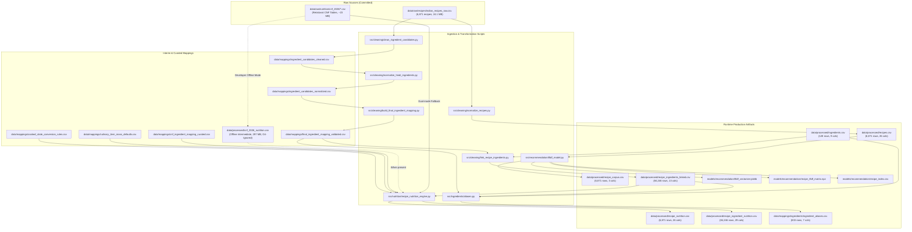

# KitchenPilot — Data Lineage & Provenance Architecture

## 1. End-to-End Data Pipeline Architecture

---

## 2. Dataset Provenance & Transformations

### 2.1 Recipe Pipeline
* **Source**: `data/raw/recipes/indian_recipes_raw.csv` (M001 / Kaggle Indian Food dataset, 6,871 recipes).
* **Script**: `src/cleaning/normalize_recipes.py`
* **Transformations**:
  - Re-indexes Srno into canonical ID `R00001` - `R06871`.
  - Maps `Course` to `meal_type` and `category`.
  - Normalizes boolean diet flags: `vegetarian`, `vegan`, `jain`, `satvik`.
  - Cleans whitespace and handles missing values without silent record dropping.
* **Output**: `data/processed/recipes.csv`

### 2.2 Ingredient Ontology & Linking Pipeline
* **Source 1**: `data/raw/recipes/indian_recipes_raw.csv` (`TranslatedIngredients`)
* **Source 2**: `data/processed/ingredients.csv` (128 canonical ingredients)
* **Scripts**:
  1. `src/cleaning/clean_ingredient_candidates.py` -> `data/mappings/ingredient_candidates_cleaned.csv`
  2. `src/cleaning/normalize_hindi_ingredients.py` -> `data/mappings/ingredient_candidates_normalized.csv`
  3. `src/cleaning/build_final_ingredient_mapping.py` -> `data/mappings/final_ingredient_mapping_validated.csv`
  4. `src/cleaning/link_recipe_ingredients.py` -> `data/processed/recipe_ingredients_linked.csv`
  5. `src/ingredients/aliases.py` -> `data/mappings/ingredients/ingredient_aliases.csv`
* **Coverage**: Links 84,246 recipe-ingredient entries to canonical database (76.82% mapped, 23.18% preserved for review).

### 2.3 Nutrition Pipeline
* **Source**: Health Canada Canadian Nutrient File (CNF) 2026 Edition.
* **Inputs**:
  - Relational tables in `data/raw/nutrition/cnf_2026/` (`nutrient_amount.csv`, `food_name.csv`, `measure_weight_conversion.csv`).
  - Curated Indian food code mappings: `data/mappings/cnf_ingredient_mapping_curated.csv`.
  - Culinary calibrations: `culinary_item_mass_defaults.csv`, `cooked_state_conversion_rules.csv`.
* **Script**: `src/nutrition/recipe_nutrition_engine.py`
* **Dual-Mode Fallback**:
  - Full Mode: uses pre-built 297 MB intermediate `cnf_2026_nutrition.csv` if available.
  - Release / Clean-Clone Mode: directly streams raw committed tables (`nutrient_amount.csv` [21 MB] and `food_name.csv` [0.8 MB]).
* **Outputs**:
  - `data/processed/recipe_nutrition.csv` (6,871 recipes)
  - `data/processed/recipe_ingredient_nutrition.csv` (84,246 ingredient items)

### 2.4 Recommendation Model Pipeline
* **Inputs**: `data/processed/recipes.csv`, `data/processed/recipe_corpus.csv`
* **Script**: `src/recommendation/tfidf_model.py`
* **Outputs**:
  - `models/recommendation/tfidf_vectorizer.joblib`
  - `models/recommendation/recipe_tfidf_matrix.npz`
  - `models/recommendation/recipe_index.csv`
