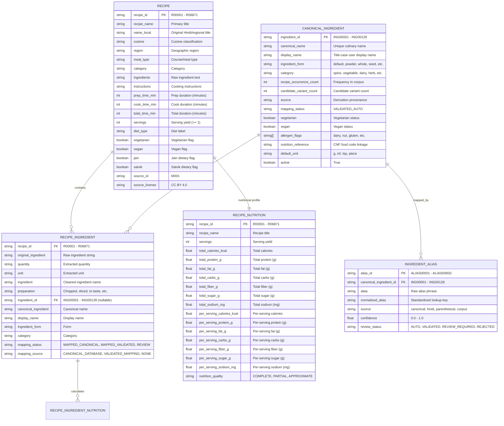

# KitchenPilot — Production Data Contract (Version 0.1.0)

## Overview & Purpose

This document defines the formal data contracts, schema constraints, entity relationships, validation rules, units, and identifiers for the production data layer of KitchenPilot (Customized AI Kitchen). It serves as the authoritative blueprint for:
1. Production dataset validation in Stage B.
2. Relational schema modeling and PostgreSQL migration in Stage C (SQLAlchemy 2.0 & Alembic).
3. Retrieval and candidate generation in Stage D (TF-IDF & BGE semantic search).
4. Constraint and hard-filtering engines in Stage E.
5. Learning-to-rank models in Stage F (XGBoost GBDT).

---

## 1. Data Versioning & Compatibility

* **Data Version**: `0.1.0` (tracked in `data/VERSION`)
* **Application Baseline**: `1.0.2` (tracked in `VERSION`)
* **Compatibility Model**: Additive backward compatibility. All V1 runtime contracts (`/api/v1/`) and files in `data/processed/` remain functional.

---

## 2. Core Entities & Relational Schemas

---

## 3. Entity Data Contracts & Types

### 3.1 Recipe Entity (`recipes.csv`)

| Field Name | Type | Nullable | Range / Allowed Values | Validation Rules | Description |
| :--- | :--- | :---: | :--- | :--- | :--- |
| `recipe_id` | String | No | Pattern `^R\d{5}$` | Unique PK, 6-char fixed length | Unique recipe identifier |
| `recipe_name` | String | No | Length >= 1 | Strip whitespace, non-empty | English/translated recipe title |
| `name_local` | String | Yes | Unicode text | Defaults to empty string | Original Hindi/regional recipe title |
| `cuisine` | String | Yes | Categorical | Strip whitespace | Regional cuisine (e.g. South Indian, Bengali) |
| `region` | String | Yes | Free text | Blank in raw corpus | Geographic culinary zone |
| `meal_type` | String | Yes | Categorical | Course or meal time | Main Course, Lunch, Side Dish, etc. |
| `category` | String | Yes | Categorical | Categorical taxonomy | Broad culinary grouping |
| `ingredients` | String | Yes | Comma-delimited | 6 nulls in raw source | Raw ingredient list |
| `instructions`| String | Yes | Free text | Cleaned text | Step-by-step cooking directions |
| `prep_time_min`| Integer| No | `>= 0` | Non-negative integer | Preparation duration in minutes |
| `cook_time_min`| Integer| No | `>= 0` | Non-negative integer | Cooking duration in minutes |
| `total_time_min`| Integer| No | `>= 0` | Non-negative integer | Total duration in minutes |
| `servings` | Integer | No | `>= 1` | Minimum 1 | Recipe yield in portions |
| `diet_type` | String | Yes | Free text | Categorical label | E.g. Vegetarian, Diabetic Friendly |
| `vegetarian` | Boolean | No | `True`, `False` | Deterministic boolean | Vegetarian dietary compliance |
| `vegan` | Boolean | No | `True`, `False` | Deterministic boolean | Strict vegan dietary compliance |
| `jain` | Boolean | No | `True`, `False` | Deterministic boolean | No root vegetables, strictly veg |
| `satvik` | Boolean | No | `True`, `False` | Deterministic boolean | No onion, no garlic |
| `contains` | String | Yes | Free text | Empty in raw corpus | Declared allergens |
| `source_id` | String | No | `M001` | Required constant | Authoritative raw dataset provenance |
| `source_license`| String | No | `CC BY 4.0` | Required license | Dataset distribution license |

### 3.2 Canonical Ingredient Entity (`ingredients.csv`)

| Field Name | Type | Nullable | Range / Format | Validation Rules | Description |
| :--- | :--- | :---: | :--- | :--- | :--- |
| `ingredient_id` | String | No | Pattern `^ING\d{5}$` | Unique PK | Canonical identifier |
| `canonical_name` | String | No | Lowercase text | Non-empty, unique with form | Normalized culinary name |
| `display_name` | String | No | Title-case text | User-facing label | UI presentation title |
| `ingredient_form`| String | No | default, powder, whole, etc. | Non-empty | Form factor of ingredient |
| `category` | String | No | spice, vegetable, dairy, etc. | Taxonomy constraint | Culinary food group |
| `recipe_occurrence_count` | Integer | No | `>= 0` | Non-negative | Corpus frequency |
| `candidate_variant_count` | Integer | No | `>= 0` | Non-negative | Number of mapped candidate strings |
| `source` | String | No | Free text | Provenance | Pipeline generation origin |
| `mapping_status` | String | No | `VALIDATED_AUTO` | Standardized status | Curation review status |

### 3.3 Ingredient Alias Entity (`ingredient_aliases.csv`)

| Field Name | Type | Nullable | Range / Format | Validation Rules | Description |
| :--- | :--- | :---: | :--- | :--- | :--- |
| `alias_id` | String | No | Pattern `^ALIAS\d{5}$` | Unique PK | Alias identifier |
| `canonical_ingredient_id` | String | No | Pattern `^ING\d{5}$` | FK to ingredients | Target canonical ingredient |
| `alias` | String | No | Unicode text | Non-empty | Raw variant or colloquial phrase |
| `normalized_alias` | String | No | Lowercase text | Non-empty, singularized | Standardized lookup key |
| `source` | String | No | canonical, hindi, parenthetical | Provenance | Origin of alias association |
| `confidence` | Float | No | `0.0 <= conf <= 1.0` | Confidence rating | Mapping certainty score |
| `review_status` | String | No | `AUTO`, `VALIDATED`, `REVIEW_REQUIRED`, `REJECTED` | Strict enum | Curation workflow status |

### 3.4 Recipe-Ingredient Link Entity (`recipe_ingredients_linked.csv`)

| Field Name | Type | Nullable | Description |
| :--- | :--- | :---: | :--- |
| `recipe_id` | String | No | FK to recipes.csv (`^R\d{5}$`) |
| `original_ingredient` | String | No | Unaltered raw line from recipe |
| `quantity` | String | Yes | Extracted numeric/fraction string |
| `unit` | String | Yes | Standardized unit (tbsp, tsp, cup, g, piece) |
| `ingredient` | String | Yes | Cleaned core ingredient string |
| `preparation` | String | Yes | State (chopped, sliced, to taste, cooked) |
| `ingredient_id` | String | Yes | FK to ingredients.csv (`^ING\d{5}$`), null if REVIEW |
| `canonical_ingredient` | String | Yes | Canonical name (null if REVIEW) |
| `display_name` | String | Yes | Title-case display name (null if REVIEW) |
| `ingredient_form` | String | Yes | Form factor (null if REVIEW) |
| `category` | String | Yes | Category (null if REVIEW) |
| `mapping_status` | String | No | `MAPPED_CANONICAL`, `MAPPED_VALIDATED`, `REVIEW` |
| `mapping_source` | String | No | `CANONICAL_DATABASE`, `VALIDATED_MAPPING`, `NONE` |

### 3.5 Recipe Nutrition Entity (`recipe_nutrition.csv`)

* All macronutrient values are expressed in **grams (g)**.
* Energy is expressed in **kilocalories (kcal)**.
* Sodium is expressed in **milligrams (mg)**.
* Both whole-recipe totals and per-serving amounts are explicitly preserved.
* `nutrition_quality` is constrained to: `COMPLETE`, `PARTIAL`, `APPROXIMATE`.

---

## 4. Referential Integrity Rules

1. **Foreign Key: Recipe Nutrition -> Recipe**: Every `recipe_id` in `recipe_nutrition.csv` must exist in `recipes.csv` (100% matched, 0 orphans).
2. **Foreign Key: Recipe Ingredients -> Recipe**: Every `recipe_id` in `recipe_ingredients_linked.csv` must exist in `recipes.csv` (6,865 recipes with parsed ingredients, 6 recipes empty in source corpus).
3. **Foreign Key: Recipe Ingredients -> Canonical Ingredient**: Every non-null `ingredient_id` in `recipe_ingredients_linked.csv` must exist in `ingredients.csv` (100% matched, 0 orphan links).
4. **Foreign Key: Ingredient Aliases -> Canonical Ingredient**: Every `canonical_ingredient_id` in `ingredient_aliases.csv` must exist in `ingredients.csv` (100% matched, 0 orphan aliases).
5. **Primary Key Uniqueness**: `recipe_id` in `recipes.csv`, `ingredient_id` in `ingredients.csv`, and `alias_id` in `ingredient_aliases.csv` must be strictly unique.
