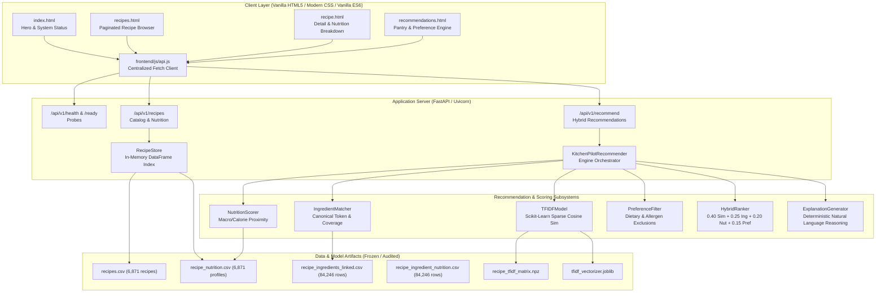

# Customized AI Kitchen — Production Migration Manifest

**Project:** KitchenPilot-V1 → Customized AI Kitchen  
**Audit Stage:** Stage A — Repository Audit & Production Migration Manifest  
**Baseline Version:** 1.0.2  
**Baseline Git Commit:** `f5f48d091701e71542acb0a74bdd98a65fe12398`  
**Date of Audit:** October 3, 2026  
**Status:** AUDIT COMPLETE — BASELINE VERIFIED  

---

## Section 1 — V1 Baseline

* **Current Branch:** `main`
* **Current Commit:** `f5f48d091701e71542acb0a74bdd98a65fe12398`
* **Current VERSION:** `1.0.2`
* **Existing Tags:** `v1.0.0`, `v1.0.1`, `v1.0.2`
* **Remote Repository:** `https://github.com/krishna-chaithanya-m/KitchenPilot-V1.git`
* **Python Runtime:** Python 3.14.5 (AMD64)
* **Virtual Environment:** `.venv\` (isolated, requirements installed)
* **Release Verification:** `scripts/release_check.py` → **ALL RELEASE CHECKS PASSED (9/9)**
* **Pytest Suite:** `tests/` → **83 passed, 1 non-fatal warning in 67.72s** (100% pass rate)
* **Nutrition Engine Validator:** `src/validation/validate_recipe_nutrition.py` → **8/8 PASS**
* **Recommendation Validator:** `src/validation/validate_recommendation_engine.py` → **14/14 PASS**

---

## Section 2 — Current Architecture



---

## Section 3 — Current Modules Inventory

| Component | Current Location | Status | Notes |
|---|---|---|---|
| **API Entrypoint** | `src/api/main.py` | `MODIFY` | Retain `/api/v1/` routes; add lifecycle management, middleware, auth hooks, and v2 router mounting. |
| **API Schemas** | `src/api/schemas.py` | `MODIFY` | Keep existing Pydantic V2 schemas; add User, Auth, Feedback, and Embedding schemas. |
| **API Dependencies** | `src/api/dependencies.py` | `MODIFY` | Keep `RecipeStore`; add DB session dependency (`get_db`) and model registry providers. |
| **API Route: Health** | `src/api/routes/health.py` | `KEEP` | Retain liveness and readiness endpoints; add database connection check. |
| **API Route: Recipes** | `src/api/routes/recipes.py` | `KEEP` | Preserves paginated catalog, recipe detail, nutrition lookup, and similarity endpoints. |
| **API Route: Recs** | `src/api/routes/recommendations.py` | `MODIFY` | Retain baseline recommendations; add user personalized recommendation routing. |
| **Recommender Core** | `src/recommendation/recommender.py` | `KEEP` | Preserves baseline `KitchenPilotRecommender` as reference/baseline model. |
| **Hybrid Ranker** | `src/recommendation/hybrid_ranker.py` | `MODIFY` | Keep weighted linear formula; extend to interface with XGBoost second-stage ranker. |
| **Ingredient Matcher** | `src/recommendation/ingredient_matcher.py` | `MODIFY` | Keep Jaccard and coverage logic; expand with comprehensive synonym ontology. |
| **Nutrition Scorer** | `src/recommendation/nutrition_scorer.py` | `KEEP` | Deterministic macro/calorie proximity scoring based on frozen profiles. |
| **Preference Filter** | `src/recommendation/preference_filter.py` | `MODIFY` | Keep dietary rules (Veg, Vegan, Jain, Satvik); add user allergy profiles. |
| **TF-IDF Model** | `src/recommendation/tfidf_model.py` | `KEEP` | Preserves lexical retrieval model for baseline benchmarking and sparse retrieval. |
| **Explainability** | `src/recommendation/explainability.py` | `MODIFY` | Extends deterministic explanation generator with semantic and personalized signals. |
| **Nutrition Engine** | `src/nutrition/recipe_nutrition_engine.py` | `KEEP` | Preserves offline batch recipe nutrition computation and state conversions. |
| **Nutrient Lookup** | `src/nutrition/nutrient_lookup.py` | `KEEP` | Dual-mode lookup (processed file with release-safe fallback to raw table). |
| **Measure Converter** | `src/nutrition/measure_converter.py` | `KEEP` | Food-specific discrete item calibrations and volumetric weight conversion. |
| **Quantity Parser** | `src/nutrition/quantity_parser.py` | `KEEP` | Regex and unicode fraction parsing for recipe ingredient strings. |
| **Evaluation Metrics**| `src/evaluation/recommendation_metrics.py` | `MODIFY` | Add Precision@K, Recall@K, NDCG@K, MRR, latency timers for semantic retrieval. |
| **Release Check** | `scripts/release_check.py` | `KEEP` | Automated verification of deployment integrity and file presence. |
| **Frontend UI** | `frontend/*.html, *.js, *.css` | `MODIFY` | Keep existing responsive design; add User Profile, Pantry Manager, and Feedback widgets. |
| **Database Layer** | *(New)* `src/database/` | `ADD` | PostgreSQL models, SQLAlchemy sessions, Alembic migrations. |
| **Semantic Retrieval**| *(New)* `src/recommendation/semantic_retrieval.py` | `ADD` | BGE embedding vector index and dense similarity search. |
| **XGBoost Ranker** | *(New)* `src/recommendation/xgboost_ranker.py` | `ADD` | GBDT re-ranking candidate recipes with learned feature interactions. |
| **User Service** | *(New)* `src/services/user_service.py` | `ADD` | User preferences, dietary history, favorites, and feedback logging. |

---

## Section 4 — Data Inventory

| Dataset | Type | Runtime? | Source | Consumer | Action |
|---|---|:---:|---|---|---|
| `data/processed/recipes.csv` (11.65 MB, 6,871 rows, 26 cols) | Processed CSV | **YES** | `indian_recipes_raw.csv` via cleaning | `RecipeStore`, API, Frontend | `KEEP` |
| `data/processed/recipe_nutrition.csv` (1.11 MB, 6,871 rows, 26 cols) | Processed CSV | **YES** | `RecipeNutritionEngine` | `RecipeStore`, `NutritionScorer`, API | `KEEP` |
| `data/processed/recipe_corpus.csv` (3.56 MB, 6,871 rows, 3 cols) | Processed CSV | **YES** | `CorpusBuilder` | `TFIDFModel`, Vectorizer | `KEEP` |
| `data/processed/recipe_ingredients_linked.csv` (10.80 MB, 84,246 rows, 13 cols) | Processed CSV | **YES** | `link_recipe_ingredients.py` | `IngredientMatcher`, API | `KEEP` |
| `data/processed/ingredients.csv` (15.4 KB, 128 rows, 9 cols) | Processed CSV | **YES** | `build_ingredient_database.py`| `IngredientMatcher` | `KEEP` |
| `data/processed/recipe_ingredient_nutrition.csv` (29.15 MB, 84,246 rows, 29 cols) | Processed CSV | **YES** | `RecipeNutritionEngine` | Validation, Fine-grained audit | `KEEP` |
| `models/recommendation/recipe_index.csv` (118 KB, 6,871 rows, 2 cols) | Model Index | **YES** | `TFIDFModel` | `TFIDFModel` | `KEEP` |
| `models/recommendation/recipe_tfidf_matrix.npz` (2.96 MB, 6,871 x 17,045) | Sparse Matrix | **YES** | `TFIDFModel` | `TFIDFModel` | `KEEP` |
| `models/recommendation/tfidf_vectorizer.joblib` (305 KB) | Joblib Serialized | **YES** | Scikit-Learn | `TFIDFModel` | `KEEP` |
| `data/raw/recipes/indian_recipes_raw.csv` (23.03 MB, 6,871 rows, 15 cols) | Raw Source | NO | Raw source repository | Ingestion/Cleaning scripts | `KEEP` |
| `data/raw/nutrition/cnf_2026/*.csv` (8 tables, 21.99 MB total) | Raw Source | NO (fallback) | Health Canada CNF 2026 | `MeasureConverter`, `NutrientLookup` | `KEEP` |
| `data/mappings/cnf_ingredient_mapping_curated.csv` (41.9 KB, 128 rows) | Mapping CSV | NO | Manual/audited curation | `RecipeNutritionEngine`, Validation | `KEEP` |
| `data/mappings/final_ingredient_mapping_validated.csv` (526 KB, 3,514 rows) | Mapping CSV | NO | Ingestion pipeline | Candidate linking scripts | `KEEP` |
| `data/mappings/cooked_state_conversion_rules.csv` (3.8 KB, 38 rules) | Mapping CSV | NO | Audited culinary rules | `RecipeNutritionEngine` | `KEEP` |
| `data/mappings/culinary_item_mass_defaults.csv` (1.4 KB, 28 items) | Mapping CSV | NO | Audited culinary calibrations | `MeasureConverter` | `KEEP` |
| `data/processed/cnf_2026_nutrition.csv` (297.12 MB, ~1.1M rows) | Generated Intermediate | NO | `normalize_cnf_2026.py` | Offline pipeline only | `KEEP (Ignored)` |
| `data/processed/recipe_ingredients_quality_checked.csv` (15.8 MB, 84,246 rows) | Generated Intermediate | NO | `generate_quality_checked_ingredients.py` | Offline pipeline only | `KEEP (Ignored)` |
| `data/backup_nutrition_stage0/*.csv` (24.2 MB) | Backup Archive | NO | Stage 0 snapshot | Audit reference | `KEEP (Ignored)` |

---

## Section 5 — Recommendation Pipeline

### Pipeline Architecture (V1 Baseline)
1. **Request Intake**:
   - Query by recipe (`query_recipe_id`), query by available ingredients (`available_ingredients`), or combined.
   - User preferences (`vegetarian`, `vegan`, `jain`, `satvik`, `cuisine`, `region`, `meal_type`, `category`, `excluded_ingredients`, `required_ingredients`).
   - Nutritional targets (`calorie_target`, `protein_target`, `max_calories`, `min_protein`, `max_fat`, `max_carbs`, `min_fiber`).
2. **Hard Filtering (`PreferenceFilter.passes_hard_filters`)**:
   - Strictly eliminates non-matching candidates before scoring.
   - Vegetarian/Vegan/Jain/Satvik flags checked against recipe metadata.
   - Excluded ingredients checked via substring and canonical ingredient matching.
3. **Pillar 1: Lexical Similarity (`TFIDFModel.compute_similarity_scores`)**:
   - Query vector created from query recipe vector or transformed available ingredient list.
   - Sparse matrix cosine similarity against 6,871 precomputed recipe vectors.
4. **Pillar 2: Ingredient Coverage (`IngredientMatcher.match_recipe`)**:
   - Resolves available ingredients to canonical ingredient dictionary (128 canonical names).
   - Computes match score: `matched_count / max(1, total_recipe_ingredients)`.
   - Computes available coverage: `matched_count / max(1, len(available_ingredients))`.
   - Flags required ingredients satisfaction (`satisfies_required`).
5. **Pillar 3: Nutrition Alignment (`NutritionScorer.score_recipe`)**:
   - Computes exponential distance penalty: `exp(-abs(per_serving - target) / target)`.
   - Evaluates minimum/maximum threshold violations.
   - Calculates `nutrition_confidence` (1.0 for audited values, reduced for missing values).
6. **Pillar 4: Preference Compatibility (`PreferenceFilter.compute_preference_score`)**:
   - Scores soft preference alignment (cuisine match +0.35, meal type +0.25, region +0.20, category +0.20).
7. **Hybrid Ranking (`HybridRanker.rank_candidates`)**:
   - $$Score_{hybrid} = 0.40 \cdot Sim + 0.25 \cdot Ing + 0.20 \cdot Nut + 0.15 \cdot Pref$$
   - Strict tie-breaking by recipe ID.
   - Bounded strictly to $[0.0, 1.0]$.
8. **Explainability (`ExplanationGenerator.generate_explanation`)**:
   - Deterministic template-based reasoning summarizing ingredient overlap and nutrition alignment.

---

## Section 6 — Nutrition Pipeline

* **Data Authority**: Canadian Nutrient File (CNF 2026), Health Canada.
* **Scope**: 128 canonical culinary ingredients mapped to 89 unique CNF food codes in `data/mappings/cnf_ingredient_mapping_curated.csv`.
* **State & Yield Adjustments**:
  - Cooking yield factors (e.g. cooked rice factor 0.38, boiled moong dal factor 0.385).
  - Soaking factor estimates (`SOAKING_YIELD_ESTIMATE`).
  - Discrete whole-item mass calibrations (e.g. 1 almond = 1.2g, 1 garlic clove = 3.0g, 1 tomato = 123.0g).
* **Per-Serving vs Per-100g**:
  - Nutrients calculated on 100g edible portion basis, scaled by converted mass in grams.
  - Recipe-level total aggregated across all ingredient rows.
  - Divided by `servings` count to produce `per_serving_*` metrics.
* **Runtime Serving**:
  - At runtime, `RecipeStore` and `NutritionScorer` load frozen values from `data/processed/recipe_nutrition.csv`.
  - Zero recalculation at query time guarantees $<10\text{ ms}$ response latency and numerical determinism.

---

## Section 7 — API Inventory

| HTTP Method | Path | Request Schema | Response Schema | Data Source | Auth | Notes |
|---|---|---|---|---|---|---|
| `GET` | `/api/v1/health` | None | `HealthCheckResponse` | System Status | Public | Liveness probe |
| `GET` | `/api/v1/health/ready` | None | `ReadinessResponse` | `RecipeStore` + `Recommender` | Public | Readiness check |
| `GET` | `/api/v1/recipes` | Query params (page, page_size, filters) | `RecipeListResponse` | `recipes.csv` via `RecipeStore` | Public | Paginated catalog search |
| `GET` | `/api/v1/recipes/{id}` | Path param `recipe_id` | `RecipeDetailResponse` | `recipes.csv` + `recipe_nutrition.csv` | Public | Recipe detail view |
| `GET` | `/api/v1/recipes/{id}/nutrition` | Path param `recipe_id` | `RecipeNutritionDetail` | `recipe_nutrition.csv` | Public | Dedicated nutrition breakdown |
| `GET` | `/api/v1/recipes/{id}/similar` | Path param `recipe_id`, query `top_k` | `RecommendationResponse` | `KitchenPilotRecommender` | Public | Recipe similarity search |
| `POST` | `/api/v1/recommend` | `RecommendRequest` | `RecommendationResponse` | `KitchenPilotRecommender` | Public | Combined hybrid recommender |
| `POST` | `/api/v1/recommend/by-ingredients`| `IngredientRecommendRequest` | `RecommendationResponse` | `KitchenPilotRecommender` | Public | Pantry-based recommender |

---

## Section 8 — Frontend Inventory

* `frontend/index.html` + `frontend/js/app.js`: Hero landing page, feature highlights, and live backend health monitor.
* `frontend/recipes.html` + `frontend/js/recipes.js`: Paginated recipe browser with text search, cuisine pills, diet toggles (Vegetarian, Vegan, Jain, Satvik), and card view.
* `frontend/recipe.html` + `frontend/js/recipe.js`: Full recipe view displaying preparation instructions, structured ingredient checklist, complete macro nutrition card, and similar recipe carousel.
* `frontend/recommendations.html` + `frontend/js/recommendations.js`: Interactive recommendation studio with tag-based pantry input, macro sliders (calories, protein), dietary restriction checkboxes, and ranked result cards with explanations.
* `frontend/css/style.css`: Modern responsive stylesheet utilizing CSS custom properties, grid layouts, accessible focus states, and mobile breakpoints.
* `frontend/js/api.js`: Unified API client with automatic environment resolution (`http://127.0.0.1:8000/api/v1` vs reverse proxy), query serialization, and structured error handling.

---

## Section 9 — ML / Model Inventory

* **Current Model Type**: Unsupervised Lexical Vector Space Model (TF-IDF + Cosine Distance).
* **Vocabulary Size**: 17,045 unigrams and bigrams (`ngram_range=(1, 2)`, `min_df=2`, `sublinear_tf=True`, `norm='l2'`).
* **Artifact Files**:
  - `models/recommendation/tfidf_vectorizer.joblib` (305 KB)
  - `models/recommendation/recipe_tfidf_matrix.npz` (2.96 MB, shape 6,871 × 17,045)
  - `models/recommendation/recipe_index.csv` (118 KB, 6,871 rows)
* **Future Production Directory Structure**:
  ```text
  models/
  ├── tfidf/
  │   ├── recipe_tfidf_matrix.npz
  │   ├── tfidf_vectorizer.joblib
  │   └── recipe_index.csv
  ├── embeddings/
  │   ├── bge_recipe_embeddings.npy
  │   └── bge_recipe_index.csv
  └── ranking/
      ├── xgboost_ranker.json
      └── feature_metadata.json
  ```

---

## Section 10 — Production Gaps Analysis

1. **Data Layer**:
   - Currently static flat CSV files in `data/processed/`.
   - No transactional integrity, concurrent write support, or relational constraints.
   - Canonical ingredient catalog limited to 128 items; ~3,500 candidate phrases require expanded alias graph.
2. **Database Layer**:
   - Absence of PostgreSQL database.
   - No persistent user tables, preference profiles, pantry inventories, interaction histories, or ratings.
3. **Retrieval Layer**:
   - TF-IDF lexical retrieval struggles with semantic synonymy (e.g. "aubergine" vs "eggplant" vs "baingan").
   - Dense semantic retrieval via dense embedding model (e.g. `BAAI/bge-small-en-v1.5`) is not yet implemented.
4. **Ranking Layer**:
   - Ranking formula is a hand-tuned static linear combination ($0.40, 0.25, 0.20, 0.15$).
   - Absence of second-stage learning-to-rank model (XGBoost GBDT) trained on user preference click/relevance signals.
5. **Nutrition Layer**:
   - CNF 2026 is Canadian; while highly accurate for core foods, missing localized Indian staples (e.g., drumstick leaves, specific millets) mapped as `NO_MATCH`.
   - Potential integration with IFCT (Indian Food Composition Tables) for native Indian ingredients.
6. **Personalization Layer**:
   - V1 is stateless: requests specify preferences per API call.
   - Absence of persistent user profiles, past cooking history, allergen lockouts, or adaptive collaborative filtering.
7. **API Layer**:
   - No authentication (JWT / OAuth2 / API keys).
   - No rate limiting, request validation against database records, or pagination cursors.
8. **Frontend Layer**:
   - Vanilla JS without component state management; lacks User Login, Saved Recipes, and Recipe Review features.
9. **Testing & Evaluation**:
   - Precision@K, Recall@K, NDCG@K, and MRR currently report `"Ground truth unavailable"` due to absence of user interaction logs.
10. **Deployment & DevOps**:
    - No containerization (`Dockerfile`, `docker-compose.yml`), CI/CD pipeline, or production ASGI server configuration (e.g., Gunicorn + Uvicorn workers).
11. **Security & Monitoring**:
    - Absence of structured JSON logging, Prometheus metrics, OpenTelemetry tracing, or CORS domain lockdown.

---

## Section 11 — Migration Stages

* **Stage A — Repository Audit & Baseline Verification**: Comprehensive audit of V1 architecture, inventory, and manifest generation (Current Stage).
* **Stage B — Production Data Architecture**: Refactor dataset directories, expand canonical ingredient alias ontology, and structure data loading pipelines.
* **Stage C — PostgreSQL Database Layer**: Design schema, implement SQLAlchemy models, configure Alembic migrations, and seed initial recipe/ingredient tables.
* **Stage D — Semantic Retrieval Engine**: Generate and index dense recipe embeddings using `BAAI/bge-small-en-v1.5`, implementing hybrid sparse-dense retrieval.
* **Stage E — Production Constraint Engine**: Fortify hard dietary filters, allergen safeguards, and localized nutrition constraint validation.
* **Stage F — Advanced GBDT Ranking**: Implement XGBoost learning-to-rank model combining lexical, semantic, nutritional, and ingredient overlap features.
* **Stage G — User Personalization & Feedback**: Implement User models, persistent pantry, favorite lists, cooking history, and rating feedback loops.
* **Stage H — Application & API Hardening**: Implement JWT authentication, rate limiting, logging, OpenAPI documentation, and frontend enhancements.
* **Stage I — Evaluation Framework**: Synthetic user benchmark suites, Precision@K, Recall@K, NDCG@K, MRR metrics, and latency benchmarking.
* **Stage J — Production Deployment & DevOps**: Dockerization, multi-stage builds, environment management, and production health probes.

---

## Section 12 — File-Level Migration Plan

| Current File | Future Role | Action | Dependencies | Risk | Target Stage |
|---|---|:---:|---|:---:|:---:|
| `src/api/main.py` | FastAPI application entrypoint | `MODIFY` | FastAPI, Routers | Low | Stage H |
| `src/api/config.py` | API & environment configuration | `MODIFY` | Pydantic Settings | Low | Stage C |
| `src/api/dependencies.py` | Dependency injection container | `MODIFY` | SQLAlchemy, Recommender | Low | Stage C |
| `src/api/schemas.py` | Pydantic data contracts | `MODIFY` | Pydantic V2 | Low | Stage C / G |
| `src/api/routes/health.py` | Health and readiness probes | `MODIFY` | DB engine | Low | Stage C |
| `src/api/routes/recipes.py` | Recipe catalog endpoints | `MODIFY` | Database Session | Medium | Stage C |
| `src/api/routes/recommendations.py` | Recommendation endpoints | `MODIFY` | Hybrid + GBDT Engine | Medium | Stage F |
| `src/recommendation/recommender.py` | Baseline recommender orchestrator | `KEEP` | TFIDFModel | Low | Stage D |
| `src/recommendation/hybrid_ranker.py` | First-stage candidate ranker | `MODIFY` | ScoredCandidate | Low | Stage F |
| `src/recommendation/ingredient_matcher.py` | Canonical ingredient matching | `MODIFY` | Ingredient ontology | Medium | Stage B |
| `src/recommendation/nutrition_scorer.py` | Nutrition scoring engine | `KEEP` | `recipe_nutrition.csv` | Low | Stage E |
| `src/recommendation/preference_filter.py` | Dietary & allergen filtering | `MODIFY` | UserPreferences | Low | Stage E |
| `src/recommendation/tfidf_model.py` | Sparse lexical retrieval | `KEEP` | Scikit-Learn | Low | Stage D |
| `src/recommendation/explainability.py` | Natural language explainer | `MODIFY` | Ranking signals | Low | Stage F |
| `src/evaluation/recommendation_metrics.py` | Evaluation suite | `MODIFY` | NumPy, Scikit-Learn | Low | Stage I |
| `frontend/js/api.js` | Frontend API client | `MODIFY` | Fetch API | Low | Stage H |
| `frontend/recommendations.html` | Recommendation UI | `MODIFY` | Modern JS | Low | Stage H |
| *(New)* `src/database/models.py` | SQLAlchemy ORM tables | `ADD` | SQLAlchemy 2.0 | Medium | Stage C |
| *(New)* `src/database/session.py` | PostgreSQL connection pool | `ADD` | psycopg2 / asyncpg | Medium | Stage C |
| *(New)* `src/recommendation/semantic_retrieval.py` | BGE dense retrieval | `ADD` | SentenceTransformers | Medium | Stage D |
| *(New)* `src/recommendation/xgboost_ranker.py` | Second-stage re-ranker | `ADD` | XGBoost | Medium | Stage F |
| *(New)* `src/services/user_service.py` | User & pantry management | `ADD` | Database | Low | Stage G |
| *(New)* `Dockerfile` & `docker-compose.yml` | Containerization deployment | `ADD` | Docker, Postgres | Medium | Stage J |
